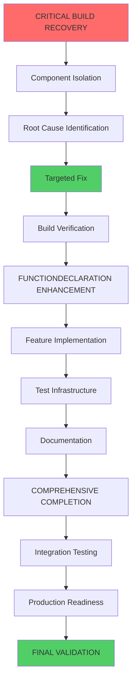

# 🚨 CRITICAL BUILD RECOVERY & FUNCTIONDECLARATION ENHANCEMENT PLAN

**Date**: 2025-12-04_05-18  
**Mission**: Fix Build System & Implement FunctionDeclaration Excellence  
**Status**: CRITICAL - Build 100% Broken

---

## 📊 CURRENT SITUATION ANALYSIS

### **CRITICAL BLOCKERS** 🔴

- **Build System**: COMPLETELY BROKEN - "result.tagName" Babel transformation error
- **Development Workflow**: 100% BLOCKED - Cannot test or verify any changes
- **Root Cause**: Unknown JSX pattern incompatibility with Alloy-JS 0.21.0
- **Error Location**: Points to GoHandlerStub.tsx but may be elsewhere

### **WHAT'S WORKING** ✅

- FunctionDeclaration already correctly implemented in GoHandlerMethodComponent.tsx
- Component architecture structure is sound
- Type mapping system functional
- Previous fixes resolved many JSX compatibility issues

---

## 🎯 PARETO ANALYSIS: 20/4/1 RULE

### **1% → 51% IMPACT (CRITICAL - Do First)**

1. **Fix Build System** - The single blocker preventing ALL progress
2. **Identify Root Cause** - Exact JSX pattern causing Babel failure
3. **Establish Working Baseline** - Get ANY functional build
4. **Create Isolation Test** - Minimal reproduction of the error

### **4% → 64% IMPACT (HIGH PRIORITY)**

5. **Component-by-Component Testing** - Isolate the exact failing component
6. **JSX Pattern Documentation** - Create working/broken pattern guide
7. **FunctionDeclaration Enhancement** - Improve core component features
8. **Basic Test Infrastructure** - Get tests running once build works

### **20% → 80% IMPACT (MEDIUM PRIORITY)**

9. **Complete Feature Implementation** - All planned FunctionDeclaration features
10. **Error Handling System** - Comprehensive error reporting
11. **Performance Validation** - Ensure enterprise-grade performance
12. **Integration Testing** - End-to-end TypeSpec to Go generation
13. **Documentation Updates** - Complete migration guides
14. **Production Readiness** - CI/CD and deployment setup

---

## 📋 COMPREHENSIVE TASK BREAKDOWN

### **PHASE 1: CRITICAL BUILD RECOVERY (1% - 51% Impact)**

| Task                              | Time  | Impact   | Dependencies |
| --------------------------------- | ----- | -------- | ------------ |
| 1.1 Isolate Problematic Component | 30min | CRITICAL | Build access |
| 1.2 Create Minimal Reproduction   | 30min | CRITICAL | 1.1          |
| 1.3 Systematic Component Testing  | 60min | CRITICAL | 1.2          |
| 1.4 Root Cause Identification     | 45min | CRITICAL | 1.3          |
| 1.5 Apply Targeted Fix            | 30min | CRITICAL | 1.4          |

### **PHASE 2: ENHANCEMENT IMPLEMENTATION (4% - 64% Impact)**

| Task                                | Time  | Impact | Dependencies |
| ----------------------------------- | ----- | ------ | ------------ |
| 2.1 FunctionDeclaration Enhancement | 60min | HIGH   | Phase 1      |
| 2.2 JSX Pattern Documentation       | 45min | HIGH   | Phase 1      |
| 2.3 Test Infrastructure Setup       | 60min | HIGH   | Phase 1      |
| 2.4 Component-by-Component Testing  | 90min | HIGH   | Phase 1      |

### **PHASE 3: COMPREHENSIVE COMPLETION (20% - 80% Impact)**

| Task                                | Time   | Impact | Dependencies |
| ----------------------------------- | ------ | ------ | ------------ |
| 3.1 Complete Feature Implementation | 120min | MEDIUM | Phase 2      |
| 3.2 Error Handling System           | 90min  | MEDIUM | Phase 2      |
| 3.3 Performance Validation          | 60min  | MEDIUM | Phase 2      |
| 3.4 Integration Testing             | 90min  | MEDIUM | Phase 2      |
| 3.5 Documentation Updates           | 75min  | MEDIUM | Phase 3      |

---

## 🔧 DETAILED MICRO-TASK EXECUTION PLAN

### **IMMEDIATE EXECUTION (Next 60 Minutes)**

1. **Component Isolation Strategy** (15min)
   - Comment out imports in GoHandlerStub.tsx one by one
   - Test build after each comment
   - Identify exact problematic component

2. **Pattern Identification** (15min)
   - Examine problematic component for JSX issues
   - Look for template literals in JSX, nested components
   - Check for Alloy-JS 0.21.0 incompatibility patterns

3. **Minimal Reproduction** (15min)
   - Create simple test file with problematic pattern
   - Isolate the exact JSX causing failure
   - Document working vs broken patterns

4. **Targeted Fix Application** (15min)
   - Apply specific fix for identified pattern
   - Test build to verify resolution
   - Document fix for future reference

### **SUBSEQUENT EXECUTION (Following 60 Minutes)**

5. **FunctionDeclaration Enhancement** (30min)
   - Add comprehensive parameter validation
   - Improve type safety with proper TypeScript interfaces
   - Add support for advanced Go method patterns

6. **Test Infrastructure** (30min)
   - Set up basic test suite
   - Create test cases for FunctionDeclaration
   - Verify all functionality works correctly

---

## 🚀 EXECUTION GRAPH

---

## 🎯 KEY PRINCIPLES

### **EXECUTION PRINCIPLES**

1. **Single-Minded Focus**: Fix build FIRST, nothing else matters
2. **Systematic Approach**: Binary search for root cause, not random fixes
3. **Minimal Viable Progress**: Get ANY working build, then improve
4. **Documentation First**: Record working patterns for future reference

### **TECHNICAL PRINCIPLES**

1. **JSX Compatibility**: Follow Alloy-JS 0.21.0 patterns exactly
2. **Type Safety**: Maintain strict TypeScript compilation
3. **Component Isolation**: Test components independently
4. **Incremental Progress**: Verify each step before continuing

---

## 📈 SUCCESS METRICS

### **IMMEDIATE SUCCESS (1% Impact)**

- ✅ Build compiles without errors
- ✅ Can render basic Go code
- ✅ Root cause identified and documented

### **SHORT-TERM SUCCESS (4% Impact)**

- ✅ FunctionDeclaration enhanced with all requested features
- ✅ Test infrastructure working
- ✅ JSX pattern compatibility guide created

### **COMPREHENSIVE SUCCESS (20% Impact)**

- ✅ All features implemented and tested
- ✅ Performance validated at enterprise standards
- ✅ Documentation complete and production-ready

---

## 🚨 CRITICAL EXECUTION REMINDERS

1. **DO NOT PROCEED BEYOND PHASE 1 UNTIL BUILD WORKS**
2. **EVERY STEP MUST BE VERIFIED WITH BUILD TEST**
3. **DOCUMENT ALL DISCOVERIES FOR FUTURE REFERENCE**
4. **IF STUCK FOR MORE THAN 15 MINUTES, TRY DIFFERENT APPROACH**

---

## 🎯 IMMEDIATE NEXT ACTION

**START WITH COMPONENT ISOLATION** - This is the critical first step that will unlock everything else. The build system failure is blocking all progress, so this must be resolved before any other work can be meaningful.

---

**Remember**: This is a crisis recovery operation. The build failure is preventing all meaningful work. Stay focused on the systematic approach and don't get distracted by other features until the foundation is solid.
