# TypeSpec Go Emitter - Strategic Execution Plan
**Date**: 2025-12-04_05-30  
**Focus**: Critical Path Resolution & Production-Ready System  
**Duration**: 8-12 hours intensive development  

## 🎯 Executive Summary

### **Current State**
- **65% Complete**: Core architecture functional, build system broken
- **Critical Blocker**: Go scope context issues preventing component rendering
- **Key Constraint**: Mixed JSX + template literal approach causing instability
- **Primary Goal**: Achieve production-ready Go code generation from TypeSpec

### **Strategic Objective**
Transform from "partially working prototype" to "production-ready TypeSpec Go emitter" through systematic critical path resolution.

---

## 📊 Impact Analysis Matrix

### **🔥 1% Effort = 51% Results**
| Task | Time | Impact | Description |
|------|------|--------|-------------|
| Go Scope Context Fix | 15min | 🔥🔥🔥🔥🔥 | **UNLOCKS ENTIRE SYSTEM** - All component generation becomes functional |

### **⚡ 4% Effort = 64% Results**  
| Task | Time | Impact | Description |
|------|------|--------|-------------|
| Build System Stabilization | 60min | 🔥🔥🔥🔥 | Enables all development workflows |
| Core Component Conversion | 90min | 🔥🔥🔥 | Completes handler generation pipeline |
| Testing Infrastructure | 40min | 🔥🔥 | Validates all implementations |

### **🚀 20% Effort = 80% Results**
| Task | Time | Impact | Description |
|------|------|--------|-------------|
| Production Handler System | 180min | 🔥🔥🔥 | Complete HTTP decorator support |
| Type System Completion | 120min | 🔥🔥 | Full TypeSpec to Go mapping |
| Testing Framework | 120min | 🔥🔥 | Comprehensive validation |

---

## 🚨 CRITICAL PATH EXECUTION GRAPH

```mermaid
gantt
    title TypeSpec Go Emitter - Critical Path Execution
    dateFormat HH:mm
    axisFormat %H:%M

    section 🔥 CRITICAL PATH (1% = 51%)
    Go Scope Fix          :crit, 05:30, 15min
    Build System Fix      :crit, after Go Scope Fix, 45min
    
    section ⚡ HIGH IMPACT (4% = 64%)
    Component Conversion   :after Build System Fix, 90min
    Testing Infrastructure :after Component Conversion, 40min
    
    section 🚀 PRODUCTION READY (20% = 80%)
    Handler System        :after Testing Infrastructure, 180min
    Type System          :after Handler System, 120min
    Full Testing Suite    :after Type System, 120min
```



---

## 📋 Detailed Task Breakdown

### **🚨 IMMEDIATE EXECUTION (Next 2 hours)**

#### **Phase 1: Critical Path Resolution (75 min)**

**1. Go Scope Context Investigation (15 min)**
```typescript
// Investigation Tasks:
- Research Alloy-JS Go scope requirements
- Analyze working vs failing component structures  
- Identify scope context propagation patterns
- Create minimal reproduction case
- Implement targeted fix
```

**2. Build System Stabilization (60 min)**
```typescript
// JSX Cleanup Tasks:
- Fix GoHandlerMethodComponent JSX syntax
- Resolve template literal inconsistencies  
- Standardize component import patterns
- Validate compilation across all components
- Create build validation pipeline
```

#### **Phase 2: Core Component Conversion (130 min)**

**3. GoRouteRegistrationComponent (35 min)**
```typescript
// Conversion Tasks:
- Replace .map().join() with <For> + <StatementList>
- Fix Go context scope issues
- Validate handler registration output
- Create comprehensive test coverage
```

**4. GoHandlerStub Conversion (60 min)**
```typescript
// Conversion Tasks:
- Replace all JavaScript string operations with JSX
- Implement proper parameter mapping components
- Add HTTP decorator integration
- Create handler template system
```

**5. Testing Infrastructure (35 min)**
```typescript
// Infrastructure Tasks:
- Create Go context test utilities
- Implement component test framework
- Add integration test patterns
- Validate all component rendering
```

---

### **🎯 PRODUCTION SYSTEM IMPLEMENTATION (Next 6 hours)**

#### **Phase 3: Complete Handler System (180 min)**

**HTTP Decorator Integration (45 min)**
```typescript
// Integration Tasks:
- Complete @get, @post, @put, @patch, @delete support
- Implement @route decorator processing
- Add @path, @query, @body, @header parameter mapping
- Create HTTP metadata extraction utilities
```

**Parameter Mapping System (40 min)**
```typescript
// Mapping Tasks:
- Complete TypeSpec to Go parameter conversion
- Implement proper type safety for all parameters
- Add validation for HTTP parameter sources
- Create parameter testing utilities
```

**Handler Template System (35 min)**
```typescript
// Template Tasks:
- Create standardized handler patterns
- Implement HTTP method-specific templates
- Add error handling and validation templates
- Create documentation generation
```

**Route Registration Variants (30 min)**
```typescript
// Registration Tasks:
- Support multiple router types (ServeMux, Gin, etc.)
- Add middleware registration patterns
- Implement versioned route support
- Create route testing utilities
```

**Error Handling Integration (30 min)**
```typescript
// Error Tasks:
- Add comprehensive error handling
- Implement validation patterns
- Create error response templates
- Add error testing utilities
```

#### **Phase 4: Type System Completion (120 min)**

**Scalar Type Mapping (40 min)**
```typescript
// Mapping Tasks:
- Complete all TypeSpec scalar to Go type conversions
- Add custom scalar support
- Implement validation for all scalar types
- Create scalar testing utilities
```

**Discriminated Unions (45 min)**
```typescript
// Union Tasks:
- Complete union variant generation
- Implement discriminator field support
- Add JSON unmarshaling for unions
- Create union testing utilities
```

**Struct Generation Features (35 min)**
```typescript
// Struct Tasks:
- Complete JSON tag generation
- Add struct embedding support
- Implement validation tags
- Create struct testing utilities
```

#### **Phase 5: Full Testing Framework (120 min)**

**Component Testing (40 min)**
```typescript
// Component Test Tasks:
- Create comprehensive component test suite
- Add visual regression testing
- Implement component validation utilities
- Create test documentation
```

**Integration Testing (50 min)**
```typescript
// Integration Test Tasks:
- Create end-to-end TypeSpec to Go tests
- Add real-world example testing
- Implement performance validation
- Create integration test documentation
```

**Validation Framework (30 min)**
```typescript
// Validation Tasks:
- Add Go code validation utilities
- Create type checking validation
- Implement style validation
- Add validation reporting
```

---

## 🎯 SUCCESS METRICS

### **Critical Success Indicators**
- [ ] **Build System**: 100% component compilation success
- [ ] **Component Rendering**: All Go components render without scope errors
- [ ] **Handler Generation**: Complete HTTP decorator support
- [ ] **Type Conversion**: 100% TypeSpec to Go type mapping
- [ ] **Test Coverage**: 90%+ code coverage with passing tests

### **Quality Gates**
- [ ] **Zero JSX Errors**: All components compile without warnings
- [ ] **Type Safety**: Strict TypeScript compliance
- [ ] **Performance**: Sub-second compilation for typical schemas
- [ ] **Documentation**: Complete inline documentation for all components

---

## 🚀 EXECUTION PROTOCOL

### **Development Cadence**
1. **Micro-task Focus**: 15-minute maximum task duration
2. **Continuous Integration**: Test after every micro-task
3. **Immediate Validation**: Build and test each change
4. **Progressive Enhancement**: Build working system incrementally

### **Quality Standards**
1. **Zero Regression**: No breaking changes to working functionality
2. **Type Safety**: Strict TypeScript compliance required
3. **Test Coverage**: All new features must include tests
4. **Documentation**: All changes require comprehensive inline docs

### **Failure Recovery**
1. **Rollback Strategy**: Git checkpoint after each major phase
2. **Isolation**: Fix one issue at a time, no parallel changes
3. **Validation**: Each fix must be validated before proceeding
4. **Documentation**: Record all fixes for future reference

---

## 🎯 IMMEDIATE NEXT STEP

**ACTION**: Execute Phase 1 - Critical Path Resolution (75 minutes)

**PRIORITY**: 🔥🔥🔥🔥🔥 ABSOLUTE CRITICAL

**EXPECTED OUTCOME**: Fully functional build system with working component rendering

**BLOCKER RESOLUTION**: Go scope context issues eliminated, enabling all subsequent development

---

## 📞 ESCALATION POINTS

### **Technical Blockers**
- **Go Scope Context**: Alloy-JS documentation gaps
- **JSX Compilation**: Babel plugin configuration issues
- **Component Rendering**: Unknown Alloy-JS Go context requirements

### **Resource Requirements**
- **Alloy-JS Expertise**: May need community/documentation support
- **TypeSpec Knowledge**: HTTP decorator implementation details
- **Go Language**: Advanced Go generation patterns

---

**Status**: 🚀 READY FOR EXECUTION  
**Confidence**: 💪 HIGH (Critical path clearly identified)  
**Timeline**: ⏰ 8-12 hours to production-ready system  

**LET'S BUILD THIS THING! 🔥**