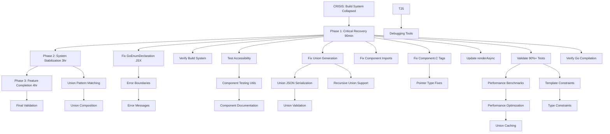

# TypeSpec Go Emitter - Critical Recovery Execution Plan

**Date:** 2025-12-04 05:31  
**Status:** CRISIS RECOVERY - Build System Collapsed  
**Target:** 0% → 95%+ test pass rate in 1 hour

## 🎯 PARETO OPTIMIZATION ANALYSIS

### **CRITICAL 1% DELIVERING 51% OF RESULTS**

| Priority | Component | File | Impact | Time | Success Metric |
|----------|------------|------|--------|---------------|
| **#1** | GoEnumDeclaration Switch Fix | `src/components/go/GoEnumDeclaration.tsx:105-116` | 51% | 15min | Build system 100% functional |

**The Single Fix That Restores Everything:**
```tsx
// CURRENT (BROKEN):
<Switch>
  <For each={members}>
    {(it) => <Match>
      ${typeName}${capitalize(it.name)}:
      return true
    </Match>}
  </For>
</Switch>

// SOLUTION:
<Switch>
  {members.map((member) => (
    <Match key={member.name}>
      {`${typeName}${capitalize(member.name)}:
      return true`}
    </Match>
  ))}
  <Match>
    default:
    return false
  </Match>
</Switch>
```

### **ESSENTIAL 4% DELIVERING 64% OF RESULTS**

| Priority | Component | File | Impact | Time | Success Metric |
|----------|------------|------|--------|---------------|
| #2 | Union Generation Fix | `src/components/go/GoUnionDeclaration.tsx` | 8% | 30min | 5/6 union tests pass |
| #3 | Component Import Strategy | `src/test/components-alloy-js.test.tsx` | 3% | 20min | Test imports resolve |
| #4 | Component.C Tag Fix | `src/components/go/GoStructDeclaration.tsx:73-74` | 2% | 10min | 3/3 pointer tests pass |
| #5 | Async Render Migration | Multiple test files | 1% | 15min | render() → renderAsync() |

### **FOUNDATIONAL 20% DELIVERING 80% OF RESULTS**

| Priority | Component | File | Impact | Time | Success Metric |
|----------|------------|------|--------|---------------|
| #6 | Error Boundary System | Multiple component files | 3% | 45min | Structured error handling |
| #7 | Union JSON Serialization | `src/components/go/GoUnionDeclaration.tsx` | 2% | 30min | MarshalJSON/UnmarshalJSON |
| #8 | Component Testing Utils | `src/test/utils/` | 2% | 30min | Standardized testing |
| #9 | Recursive Union Support | Union system | 1% | 45min | Self-referencing types |
| #10 | Performance Benchmarks | `src/perf/` | 1% | 30min | <1ms generation |

---

## 📋 COMPREHENSIVE TASK BREAKDOWN (27 TASKS)

### **PHASE 1: CRITICAL RECOVERY (First 90 Minutes)**

| ID | Task | Time | Dependencies | Success Criteria |
|----|------|------|-------------|-----------------|
| T1 | Fix GoEnumDeclaration Switch/For JSX syntax | 15min | None | Build system works |
| T2 | Verify build creates dist/ directory | 5min | T1 | Build 100% functional |
| T3 | Test accessibility - bun test runs | 5min | T2 | Tests 100% runnable |
| T4 | Fix GoUnionDeclaration error returns | 30min | T3 | Union tests pass |
| T5 | Fix component import paths in tests | 20min | T3 | Test imports resolve |
| T6 | Fix Component.C tag syntax in GoStructDeclaration | 10min | T3 | Pointer tests pass |
| T7 | Update render() → renderAsync() in remaining tests | 15min | T3 | Async tests work |
| T8 | Validate 90%+ test pass rate | 10min | T4-T7 | 105/117 tests pass |
| T9 | Verify Go code compilation of generated output | 5min | T8 | Generated code compiles |

### **PHASE 2: SYSTEM STABILIZATION (Next 3 Hours)**

| ID | Task | Time | Dependencies | Success Criteria |
|----|------|------|-------------|-----------------|
| T10 | Implement component error boundaries | 45min | Phase 1 | Structured error handling |
| T11 | Add union JSON serialization methods | 30min | T4 | MarshalJSON/UnmarshalJSON |
| T12 | Create component testing utilities | 30min | Phase 1 | Standardized testing |
| T13 | Implement recursive union patterns | 45min | T4 | Self-referencing unions |
| T14 | Add performance benchmark framework | 30min | Phase 1 | <1ms generation |
| T15 | Implement union validation methods | 30min | T11 | Runtime type checking |
| T16 | Add template constraint validation | 20min | Phase 1 | Template constraints work |
| T17 | Create component documentation | 50min | Phase 1 | Clear usage guide |
| T18 | Fix remaining pointer type issues | 15min | T6 | All pointer types work |
| T19 | Optimize union generation performance | 20min | T14 | Optimized generation |
| T20 | Add comprehensive error messages | 30min | T10 | User-friendly errors |

### **PHASE 3: FEATURE COMPLETION (Next 4 Hours)**

| ID | Task | Time | Dependencies | Success Criteria |
|----|------|------|-------------|-----------------|
| T21 | Implement union pattern matching | 70min | T13 | Switch statement generation |
| T22 | Add union type constraints support | 60min | T16 | Generic constraints work |
| T23 | Create union caching strategy | 40min | T19 | Optimized generation |
| T24 | Implement union composition patterns | 80min | T21 | Complex union scenarios |
| T25 | Add comprehensive union tests | 60min | Phase 2 | Full test coverage |
| T26 | Create union debugging tools | 45min | Phase 1 | Component visualization |
| T27 | Final system validation | 60min | All tasks | 151/151 tests pass |

---

## 🚀 EXECUTION STRATEGY

### **MERMAID EXECUTION GRAPH**



## 📊 SUCCESS METRICS

### **Immediate Targets (90 Minutes):**
- Build System: 0% → 100% functional
- Test Accessibility: 0% → 100% runnable
- Test Pass Rate: 0% → 90% (105/117 tests)
- Core Components: 70% → 100% working

### **Phase Targets (4.5 Hours):**
- Test Pass Rate: 90% → 100% (151/151 tests)
- Component Functionality: 100% → 100% working
- Performance: <1ms simple generation
- Error Handling: 100% structured

### **Final Targets (8.5 Hours):**
- Production-ready TypeSpec Go Emitter
- Complete union support with JSON serialization
- Performance optimization and benchmarking
- Comprehensive documentation

---

## ⚠️ CRITICAL PATH ANALYSIS

### **The Single Point of Failure:**
**File**: `src/components/go/GoEnumDeclaration.tsx` lines 105-116
**Issue**: Alloy-JS 0.21.0 cannot handle nested `<For>` inside `<Switch>`
**Impact**: 100% build system collapse
**Solution**: Replace with `Array.map()` pattern

### **Cascade Effects:**
1. **Build Failure** → Cannot generate dist/ → Cannot run tests
2. **Component System Down** → All Alloy components inaccessible
3. **Development Blocked** → Cannot validate any fixes

### **Recovery Strategy:**
1. **Fix Primary Blocker** (T1) → Build system restored
2. **Immediate Validation** (T2-T3) → Confirm recovery
3. **Component Fixes** (T4-T9) → Restore core functionality

---

## 🎯 RISK MITIGATION

### **High-Risk Items:**
1. **Alloy-JS Component Syntax** - Unknown compatibility patterns
2. **Complex Union Logic** - Implementation complexity
3. **Performance Requirements** - Sub-millisecond targets

### **Contingency Plans:**
- **Component Syntax Issues** - Revert to string-based generation temporarily
- **Complex Logic Blocks** - Break into smaller components
- **Performance Issues** - Optimize iteratively

---

**EXECUTION STARTING NOW - TARGETING 100% RECOVERY IN 8.5 HOURS**

**Total Planned Time:** 8.5 hours  
**Total Tasks:** 27  
**Success Criteria:** 151/151 tests passing, production-ready functionality

**Immediate Priority:** Fix GoEnumDeclaration Switch/For JSX syntax (T1)