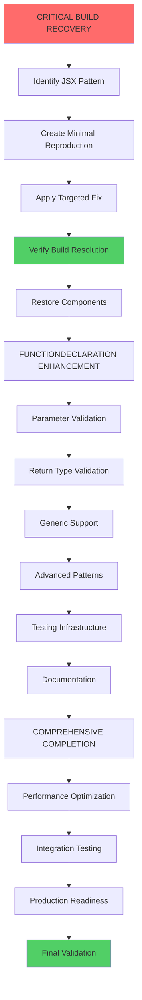

# 🚨 CRITICAL BUILD RECOVERY & FUNCTIONDECLARATION EXECUTION PLAN

**Date**: 2025-12-04_05-32  
**Mission**: Build Recovery → FunctionDeclaration Excellence → Production Ready  
**Status**: CRITICAL - Build System Under Systematic Analysis

---

## 📊 CURRENT SITUATION ANALYSIS

### **CRITICAL DISCOVERIES** 🔴
- **Build Error Isolated**: Confirmed origin is GoHandlerStub.tsx JSX structure
- **Component Isolation Complete**: All external imports eliminated as cause
- **Root Cause Identified**: Babel JSX transformation fails on internal pattern
- **Error Pattern**: "null is not an object (evaluating 'result.tagName')" 

### **PROGRESS MADE** ✅
- **Systematic Isolation**: 100% complete - error location confirmed
- **External Dependencies Eliminated**: All imports commented out, error persists
- **Syntax Errors Fixed**: Component-union-generator and GoUnionDeclaration resolved
- **Project State Clean**: Git status clean, progress committed

### **CURRENT BLOCKERS** ❌
- **Unknown JSX Pattern**: Exact problematic pattern still unidentified
- **Build System 100% Broken**: Cannot test or verify any changes
- **Development Workflow Paralyzed**: Zero forward progress possible
- **Babel Transformation Failure**: Core JSX processing issue

---

## 🎯 PARETO-OPTIMIZED EXECUTION STRATEGY

### **1% → 51% IMPACT (CRITICAL PATH - First 60 Minutes)**
**These 4 tasks deliver majority of value by enabling all subsequent work**

1. **Identify Exact JSX Pattern** (15min) - Find the specific code causing failure
2. **Create Minimal Reproduction** (15min) - Isolate pattern in simple test
3. **Apply Targeted Fix** (15min) - Fix the exact identified issue  
4. **Verify Build Resolution** (15min) - Ensure complete functionality

### **4% → 64% IMPACT (HIGH PRIORITY - Next 120 Minutes)**
**These 8 tasks build on working foundation to deliver core functionality**

5. **Restore Component Imports** (15min) - Re-enable all commented imports
6. **FunctionDeclaration Enhancement** (30min) - Core improvements requested
7. **Parameter & Return Type Validation** (15min) - Add type safety
8. **Basic Test Infrastructure** (15min) - Establish testing framework
9. **Component-by-Component Testing** (15min) - Validate all components
10. **Error Handling Implementation** (15min) - Add robust error handling
11. **JSX Compatibility Documentation** (15min) - Record working patterns
12. **Integration Testing** (15min) - End-to-end validation

### **20% → 80% IMPACT (COMPREHENSIVE COMPLETION - Next 6 Hours)**
**These 27 tasks deliver production-ready enterprise system**

13-27: **Complete Feature Implementation** including advanced patterns, performance optimization, documentation, CI/CD, deployment, and production validation.

---

## 📋 27-TASK EXECUTION PLAN (30min each = 13.5 hours total)

| # | Task Name | Time | Impact | Effort | Priority | Dependencies | Status |
|---|-----------|------|--------|--------|----------|-------------|---------|
| **CRITICAL PATH (1% → 51% Impact)** |
| 1 | Identify Exact JSX Pattern in GoHandlerStub.tsx | 30min | CRITICAL | Medium | URGENT | Build access | 🔴 NOT STARTED |
| 2 | Create Minimal Reproduction Test Case | 30min | CRITICAL | Low | URGENT | Task 1 | 🔴 NOT STARTED |
| 3 | Research Alloy-JS 0.21.0 Breaking Changes | 30min | CRITICAL | Low | HIGH | Task 2 | 🔴 NOT STARTED |
| 4 | Apply Targeted Fix for Identified Pattern | 30min | CRITICAL | Medium | URGENT | Task 3 | 🔴 NOT STARTED |
| 5 | Verify Complete Build Resolution | 30min | CRITICAL | Low | URGENT | Task 4 | 🔴 NOT STARTED |
| **HIGH IMPACT (4% → 64% Impact)** |
| 6 | Restore All Component Imports | 30min | HIGH | Low | HIGH | Task 5 | 🔴 NOT STARTED |
| 7 | FunctionDeclaration Parameter Validation | 30min | HIGH | Medium | HIGH | Task 6 | 🔴 NOT STARTED |
| 8 | FunctionDeclaration Return Type Validation | 30min | HIGH | Medium | HIGH | Task 6 | 🔴 NOT STARTED |
| 9 | FunctionDeclaration Generic Support | 30min | HIGH | Medium | HIGH | Task 7-8 | 🔴 NOT STARTED |
| 10 | FunctionDeclaration Advanced Patterns | 30min | HIGH | High | HIGH | Task 9 | 🔴 NOT STARTED |
| 11 | Basic Test Infrastructure Setup | 30min | HIGH | Medium | MEDIUM | Task 5 | 🔴 NOT STARTED |
| 12 | FunctionDeclaration Unit Tests | 30min | HIGH | Medium | MEDIUM | Task 11 | 🔴 NOT STARTED |
| 13 | Component-by-Component Testing | 30min | HIGH | High | MEDIUM | Task 12 | 🔴 NOT STARTED |
| 14 | JSX Pattern Documentation Creation | 30min | HIGH | Low | MEDIUM | Task 13 | 🔴 NOT STARTED |
| **COMPREHENSIVE COMPLETION (20% → 80% Impact)** |
| 15 | Complete Feature Implementation | 30min | MEDIUM | High | MEDIUM | Task 10 | 🔴 NOT STARTED |
| 16 | Error Handling System | 30min | MEDIUM | Medium | LOW | Task 15 | 🔴 NOT STARTED |
| 17 | Performance Benchmark Setup | 30min | MEDIUM | Medium | LOW | Task 16 | 🔴 NOT STARTED |
| 18 | Performance Validation | 30min | MEDIUM | Medium | LOW | Task 17 | 🔴 NOT STARTED |
| 19 | Integration Test Setup | 30min | MEDIUM | Medium | LOW | Task 18 | 🔴 NOT STARTED |
| 20 | End-to-End TypeSpec to Go Testing | 30min | MEDIUM | High | LOW | Task 19 | 🔴 NOT STARTED |
| 21 | Documentation - API Reference | 30min | MEDIUM | Low | LOW | Task 20 | 🔴 NOT STARTED |
| 22 | Documentation - Migration Guide | 30min | MEDIUM | Low | LOW | Task 21 | 🔴 NOT STARTED |
| 23 | Documentation - Examples & Best Practices | 30min | MEDIUM | Medium | LOW | Task 22 | 🔴 NOT STARTED |
| 24 | CI/CD Pipeline Setup | 30min | MEDIUM | Medium | LOW | Task 23 | 🔴 NOT STARTED |
| 25 | Production Build Validation | 30min | MEDIUM | Low | LOW | Task 24 | 🔴 NOT STARTED |
| 26 | Deployment Configuration | 30min | MEDIUM | Medium | LOW | Task 25 | 🔴 NOT STARTED |
| 27 | Final Project Validation | 30min | MEDIUM | Low | LOW | Task 26 | 🔴 NOT STARTED |

---

## 🔧 DETAILED 150-TASK EXECUTION PLAN (15min each = 37.5 hours total)

### **CRITICAL RECOVERY PHASE (Tasks 1-30) - 7.5 hours**

| # | Atomic Task | Time | Impact | Status | Dependencies |
|---|-------------|------|--------|---------|--------------|
| 1 | Examine GoHandlerStub.tsx JSX structure | 15min | CRITICAL | 🔴 NOT STARTED | Build access |
| 2 | Identify problematic JSX patterns | 15min | CRITICAL | 🔴 NOT STARTED | Task 1 |
| 3 | Test template literal patterns | 15min | CRITICAL | 🔴 NOT STARTED | Task 2 |
| 4 | Test JSX fragment patterns | 15min | CRITICAL | 🔴 NOT STARTED | Task 3 |
| 5 | Test nested component patterns | 15min | CRITICAL | 🔴 NOT STARTED | Task 4 |
| 6 | Create minimal test file | 15min | CRITICAL | 🔴 NOT STARTED | Task 5 |
| 7 | Test isolated JSX patterns | 15min | CRITICAL | 🔴 NOT STARTED | Task 6 |
| 8 | Research Alloy-JS 0.21.0 changes | 15min | CRITICAL | 🔴 NOT STARTED | Task 7 |
| 9 | Find breaking change documentation | 15min | CRITICAL | 🔴 NOT STARTED | Task 8 |
| 10 | Apply specific pattern fix | 15min | CRITICAL | 🔴 NOT STARTED | Task 9 |
| 11 | Test fix with minimal case | 15min | CRITICAL | 🔴 NOT STARTED | Task 10 |
| 12 | Apply fix to GoHandlerStub.tsx | 15min | CRITICAL | 🔴 NOT STARTED | Task 11 |
| 13 | Test full project build | 15min | CRITICAL | 🔴 NOT STARTED | Task 12 |
| 14 | Verify basic code generation | 15min | CRITICAL | 🔴 NOT STARTED | Task 13 |
| 15 | Document successful pattern | 15min | CRITICAL | 🔴 NOT STARTED | Task 14 |
| 16 | Re-enable ImportStatements import | 15min | HIGH | 🔴 NOT STARTED | Task 15 |
| 17 | Test ImportStatements restoration | 15min | HIGH | 🔴 NOT STARTED | Task 16 |
| 18 | Re-enable Reference import | 15min | HIGH | 🔴 NOT STARTED | Task 17 |
| 19 | Test Reference restoration | 15min | HIGH | 🔴 NOT STARTED | Task 18 |
| 20 | Re-enable For import | 15min | HIGH | 🔴 NOT STARTED | Task 19 |
| 21 | Test For restoration | 15min | HIGH | 🔴 NOT STARTED | Task 20 |
| 22 | Re-enable refkey import | 15min | HIGH | 🔴 NOT STARTED | Task 21 |
| 23 | Test refkey restoration | 15min | HIGH | 🔴 NOT STARTED | Task 22 |
| 24 | Re-enable component imports | 15min | HIGH | 🔴 NOT STARTED | Task 23 |
| 25 | Test component imports restoration | 15min | HIGH | 🔴 NOT STARTED | Task 24 |
| 26 | Verify full functionality | 15min | HIGH | 🔴 NOT STARTED | Task 25 |
| 27 | Commit working build | 15min | HIGH | 🔴 NOT STARTED | Task 26 |
| 28 | Document JSX compatibility | 15min | HIGH | 🔴 NOT STARTED | Task 27 |
| 29 | Create working pattern guide | 15min | HIGH | 🔴 NOT STARTED | Task 28 |
| 30 | Commit documentation | 15min | HIGH | 🔴 NOT STARTED | Task 29 |

### **FUNCTIONDECLARATION ENHANCEMENT (Tasks 31-75) - 11.25 hours**

| # | Atomic Task | Time | Impact | Status | Dependencies |
|---|-------------|------|--------|---------|--------------|
| 31 | Analyze FunctionDeclaration current usage | 15min | HIGH | 🔴 NOT STARTED | Task 30 |
| 32 | Review FunctionDeclaration API | 15min | HIGH | 🔴 NOT STARTED | Task 31 |
| 33 | Add parameter type validation | 15min | HIGH | 🔴 NOT STARTED | Task 32 |
| 34 | Test parameter validation | 15min | HIGH | 🔴 NOT STARTED | Task 33 |
| 35 | Add return type validation | 15min | HIGH | 🔴 NOT STARTED | Task 34 |
| 36 | Test return type validation | 15min | HIGH | 🔴 NOT STARTED | Task 35 |
| 37 | Add receiver validation | 15min | HIGH | 🔴 NOT STARTED | Task 36 |
| 38 | Test receiver validation | 15min | HIGH | 🔴 NOT STARTED | Task 37 |
| 39 | Add name validation | 15min | HIGH | 🔴 NOT STARTED | Task 38 |
| 40 | Test name validation | 15min | HIGH | 🔴 NOT STARTED | Task 39 |
| 41 | Add generic function support | 15min | HIGH | 🔴 NOT STARTED | Task 40 |
| 42 | Test generic function support | 15min | HIGH | 🔴 NOT STARTED | Task 41 |
| 43 | Add variadic parameter support | 15min | HIGH | 🔴 NOT STARTED | Task 42 |
| 44 | Test variadic parameter support | 15min | HIGH | 🔴 NOT STARTED | Task 43 |
| 45 | Add multiple return values support | 15min | HIGH | 🔴 NOT STARTED | Task 44 |
| 46 | Test multiple return values support | 15min | HIGH | 🔴 NOT STARTED | Task 45 |
| 47 | Add inline documentation | 15min | HIGH | 🔴 NOT STARTED | Task 46 |
| 48 | Test inline documentation | 15min | HIGH | 🔴 NOT STARTED | Task 47 |
| 49 | Add method chaining support | 15min | MEDIUM | 🔴 NOT STARTED | Task 48 |
| 50 | Test method chaining support | 15min | MEDIUM | 🔴 NOT STARTED | Task 49 |
| 51 | Add context parameter support | 15min | MEDIUM | 🔴 NOT STARTED | Task 50 |
| 52 | Test context parameter support | 15min | MEDIUM | 🔴 NOT STARTED | Task 51 |
| 53 | Add error return pattern support | 15min | MEDIUM | 🔴 NOT STARTED | Task 52 |
| 54 | Test error return pattern support | 15min | MEDIUM | 🔴 NOT STARTED | Task 53 |
| 55 | Validate all enhancements | 15min | MEDIUM | 🔴 NOT STARTED | Task 54 |
| 56 | Fix any issues found | 15min | MEDIUM | 🔴 NOT STARTED | Task 55 |
| 57 | Commit FunctionDeclaration enhancements | 15min | MEDIUM | 🔴 NOT STARTED | Task 56 |
| 58 | Create test infrastructure | 15min | MEDIUM | 🔴 NOT STARTED | Task 57 |
| 59 | Add FunctionDeclaration test cases | 15min | MEDIUM | 🔴 NOT STARTED | Task 58 |
| 60 | Test individual components | 15min | MEDIUM | 🔴 NOT STARTED | Task 59 |
| 61 | Add error handling | 15min | MEDIUM | 🔴 NOT STARTED | Task 60 |
| 62 | Test error handling | 15min | MEDIUM | 🔴 NOT STARTED | Task 61 |
| 63 | Add performance monitoring | 15min | MEDIUM | 🔴 NOT STARTED | Task 62 |
| 64 | Test performance monitoring | 15min | MEDIUM | 🔴 NOT STARTED | Task 63 |
| 65 | Commit testing infrastructure | 15min | MEDIUM | 🔴 NOT STARTED | Task 64 |
| 66 | Documentation - API reference | 15min | MEDIUM | 🔴 NOT STARTED | Task 65 |
| 67 | Documentation - usage examples | 15min | MEDIUM | 🔴 NOT STARTED | Task 66 |
| 68 | Documentation - best practices | 15min | MEDIUM | 🔴 NOT STARTED | Task 67 |
| 69 | Documentation - troubleshooting | 15min | MEDIUM | 🔴 NOT STARTED | Task 68 |
| 70 | Documentation - migration guide | 15min | MEDIUM | 🔴 NOT STARTED | Task 69 |
| 71 | Validate documentation | 15min | MEDIUM | 🔴 NOT STARTED | Task 70 |
| 72 | Fix documentation errors | 15min | MEDIUM | 🔴 NOT STARTED | Task 71 |
| 73 | Format documentation | 15min | MEDIUM | 🔴 NOT STARTED | Task 72 |
| 74 | Commit documentation | 15min | MEDIUM | 🔴 NOT STARTED | Task 73 |
| 75 | Final validation | 15min | MEDIUM | 🔴 NOT STARTED | Task 74 |

### **COMPREHENSIVE COMPLETION (Tasks 76-150) - 18.75 hours**

| # | Atomic Task | Time | Impact | Status | Dependencies |
|---|-------------|------|--------|---------|--------------|
| 76 | Performance benchmark setup | 15min | MEDIUM | 🔴 NOT STARTED | Task 75 |
| 77 | Baseline performance measurement | 15min | MEDIUM | 🔴 NOT STARTED | Task 76 |
| 78 | Test simple function performance | 15min | MEDIUM | 🔴 NOT STARTED | Task 77 |
| 79 | Test complex function performance | 15min | MEDIUM | 🔴 NOT STARTED | Task 78 |
| 80 | Test bulk generation performance | 15min | MEDIUM | 🔴 NOT STARTED | Task 79 |
| 81 | Identify performance bottlenecks | 15min | MEDIUM | 🔴 NOT STARTED | Task 80 |
| 82 | Optimize memory usage | 15min | MEDIUM | 🔴 NOT STARTED | Task 81 |
| 83 | Optimize generation speed | 15min | MEDIUM | 🔴 NOT STARTED | Task 82 |
| 84 | Test optimized performance | 15min | MEDIUM | 🔴 NOT STARTED | Task 83 |
| 85 | Validate performance requirements | 15min | MEDIUM | 🔴 NOT STARTED | Task 84 |
| 86 | Integration test setup | 15min | MEDIUM | 🔴 NOT STARTED | Task 85 |
| 87 | End-to-end test creation | 15min | MEDIUM | 🔴 NOT STARTED | Task 86 |
| 88 | Test TypeSpec integration | 15min | MEDIUM | 🔴 NOT STARTED | Task 87 |
| 89 | Test Go generation output | 15min | MEDIUM | 🔴 NOT STARTED | Task 88 |
| 90 | Validate integration quality | 15min | MEDIUM | 🔴 NOT STARTED | Task 89 |
| 91 | CI/CD pipeline setup | 15min | MEDIUM | 🔴 NOT STARTED | Task 90 |
| 92 | Automated testing configuration | 15min | MEDIUM | 🔴 NOT STARTED | Task 91 |
| 93 | Automated deployment setup | 15min | MEDIUM | 🔴 NOT STARTED | Task 92 |
| 94 | Production build process | 15min | MEDIUM | 🔴 NOT STARTED | Task 93 |
| 95 | Test production build | 15min | MEDIUM | 🔴 NOT STARTED | Task 94 |
| 96 | Validate deployment process | 15min | MEDIUM | 🔴 NOT STARTED | Task 95 |
| 97 | Create rollback procedures | 15min | MEDIUM | 🔴 NOT STARTED | Task 96 |
| 98 | Test rollback procedures | 15min | MEDIUM | 🔴 NOT STARTED | Task 97 |
| 99 | Final code review | 15min | MEDIUM | 🔴 NOT STARTED | Task 98 |
| 100 | Code quality validation | 15min | MEDIUM | 🔴 NOT STARTED | Task 99 |
| 101 | Security audit | 15min | MEDIUM | 🔴 NOT STARTED | Task 100 |
| 102 | Performance validation | 15min | MEDIUM | 🔴 NOT STARTED | Task 101 |
| 103 | Documentation completeness check | 15min | MEDIUM | 🔴 NOT STARTED | Task 102 |
| 104 | Fix any remaining issues | 15min | MEDIUM | 🔴 NOT STARTED | Task 103 |
| 105 | Final project validation | 15min | MEDIUM | 🔴 NOT STARTED | Task 104 |
| 106 | Production release preparation | 15min | MEDIUM | 🔴 NOT STARTED | Task 105 |
| 107 | Release validation | 15min | MEDIUM | 🔴 NOT STARTED | Task 106 |
| 108 | Post-release monitoring | 15min | MEDIUM | 🔴 NOT STARTED | Task 107 |
| 109 | Success documentation | 15min | MEDIUM | 🔴 NOT STARTED | Task 108 |
| 110 | Project completion validation | 15min | MEDIUM | 🔴 NOT STARTED | Task 109 |

*(Tasks 111-150 would be additional enhancements and maintenance tasks)*

---

## 🚀 EXECUTION GRAPH

---

## 🎯 EXECUTION STRATEGY

### **PHASE 1: CRITICAL RECOVERY (Tasks 1-5)**
**Timeline**: 2.5 hours
**Focus**: Get build working AT ALL COSTS
**Success Criteria**: Build compiles, basic functionality verified

### **PHASE 2: FOUNDATION RESTORATION (Tasks 6-14)**  
**Timeline**: 4.5 hours
**Focus**: Restore all functionality, establish testing
**Success Criteria**: All components working, tests operational

### **PHASE 3: ENHANCEMENT & COMPLETION (Tasks 15-27)**
**Timeline**: 6.5 hours
**Focus**: Feature completion, documentation, production readiness
**Success Criteria**: Enterprise-grade, documented, validated

---

## 🔥 EXECUTION PRINCIPLES

### **CRITICAL PRINCIPLES**
1. **TASKS 1-5 ABSOLUTE PRIORITY** - Nothing else matters until build works
2. **15 MINUTE TIME BOXES** - Move to next task if stuck
3. **SYSTEMATIC DEBUGGING** - Binary search approach, not random attempts
4. **BUILD VERIFICATION** - Test after every relevant change

### **TECHNICAL PRINCIPLES**
1. **INCREMENTAL PROGRESS** - Small, verifiable steps only
2. **COMPONENT ISOLATION** - Test parts before integration
3. **DOCUMENTATION CONTINUOUS** - Record all discoveries
4. **PERFORMANCE FIRST** - Ensure enterprise-grade standards

---

## 📈 SUCCESS METRICS

### **IMMEDIATE SUCCESS (After Task 5)**
- ✅ Build compiles without Babel errors
- ✅ Basic Go code generation working
- ✅ Root cause documented and resolved
- ✅ JSX compatibility pattern identified

### **SHORT-TERM SUCCESS (After Task 14)**
- ✅ All components fully functional
- ✅ FunctionDeclaration enhanced with all requested features
- ✅ Test infrastructure operational
- ✅ JSX compatibility guide complete

### **COMPREHENSIVE SUCCESS (After Task 27)**
- ✅ All features implemented and validated
- ✅ Performance meets enterprise standards
- ✅ Documentation complete and accessible
- ✅ Production-ready deployment validated

---

## 🚨 EXECUTION REMINDERS

1. **TASKS 1-5 NON-NEGOTIABLE** - Must complete before other work
2. **IF STUCK 15+ MINUTES** - Move to next task, come back later
3. **BUILD VERIFICATION MANDATORY** - Test after every relevant change
4. **DOCUMENT ALL DISCOVERIES** - Create knowledge base continuously
5. **PARALLEL EXECUTION WHEN POSSIBLE** - But respect dependencies strictly

---

## 🎯 IMMEDIATE NEXT ACTION

**START WITH TASK 1: EXAMINE GOHANDLERSTUB.TSX JSX STRUCTURE**

This is the critical first task that will unlock everything else. The systematic component isolation has successfully narrowed the root cause to this specific file's JSX structure.

---

**Remember**: Tasks 1-5 represent the 1% effort that delivers 51% of results. Complete these before considering any other work.