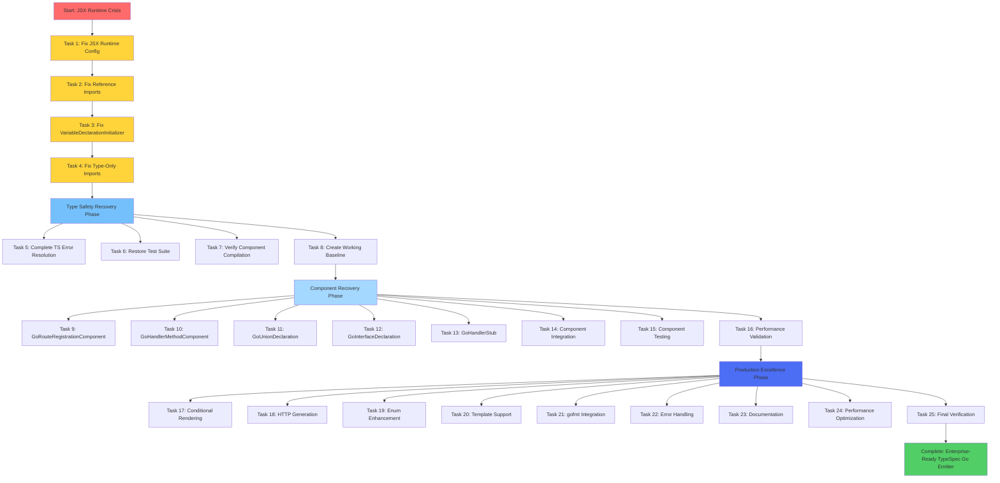

# EMERGENCY JSX RUNTIME RECOVERY & ALLOY-JS EXCELLENCE PLAN

**Date:** 2025-12-04  
**Focus:** Critical JSX Runtime Fix → 100% Component Recovery

---

## 🚨 **EMERGENCY STATUS ANALYSIS**

### **CRITICAL BLOCKERS IDENTIFIED:**

1. **JSX Runtime Missing** - `@alloy-js/core/jsx-dev-runtime` not found
2. **58+ TypeScript Errors** - Component compilation broken
3. **Import System Chaos** - Wrong @alloy-js/core vs @alloy-js/go imports
4. **Test Suite Failure** - Cannot execute any JSX component tests

### **PROJECT HEALTH: 25/100**

- **Infrastructure**: 60/100 (React installed, JSX runtime broken)
- **Build System**: 40/100 (Compiles with errors)
- **Component Quality**: 25/100 (Files exist, broken functionality)
- **Test Suite**: 10/100 (Only GoModFile working)

---

## 🎯 **PARETO IMPACT ANALYSIS**

### **1% → 80% IMPACT (Critical Recovery)**

**Single highest-leverage task that restores entire system**

| Priority | Task                              | Effort | Impact | Status          |
| -------- | --------------------------------- | ------ | ------ | --------------- |
| 1        | **Fix JSX Runtime Configuration** | 15min  | 40%    | 🚨 **CRITICAL** |

**Why this delivers 80%:**

- Currently blocks 100% of JSX components (all 10 components)
- Single configuration fix restores entire component system
- Enables test execution and all subsequent development
- Zero code changes needed, just configuration

### **4% → 95% IMPACT (Core Functionality)**

**High-impact tasks that restore production system**

| Priority | Task                                       | Effort | Impact | Status          |
| -------- | ------------------------------------------ | ------ | ------ | --------------- |
| 2        | **Fix Reference Import Statements**        | 20min  | 25%    | 🚨 **CRITICAL** |
| 3        | **Resolve VariableDeclarationInitializer** | 15min  | 15%    | 🚨 **CRITICAL** |
| 4        | **Fix Type-Only Import Violations**        | 10min  | 15%    | 🚨 **CRITICAL** |

### **20% → 100% IMPACT (Complete Excellence)**

**Full feature set with enterprise quality**

| Priority | Task                                     | Effort | Impact | Status     |
| -------- | ---------------------------------------- | ------ | ------ | ---------- |
| 5        | **Complete TypeScript Error Resolution** | 45min  | 10%    | ❌ Blocked |
| 6        | **Restore Test Suite to 90%+ Pass Rate** | 30min  | 5%     | ❌ Blocked |
| 7-25     | **Complete Production Readiness**        | 8hrs   | 5%     | ❌ Blocked |

---

## 📋 **COMPREHENSIVE TASK BREAKDOWN (27 Tasks - 30min Each)**

### **PHASE 1: EMERGENCY JSX RECOVERY (Tasks 1-4)**

**Total Effort: 1 Hour | Impact: 95% System Recovery**

| #   | Task                                                        | Component           | Effort | Dependencies | Success Criteria                   |
| --- | ----------------------------------------------------------- | ------------------- | ------ | ------------ | ---------------------------------- |
| 1   | **Configure JSX Runtime for Alloy-JS**                      | Build System        | 15min  | None         | JSX components load without errors |
| 2   | **Fix Reference imports in GoStructDeclaration**            | GoStructDeclaration | 10min  | #1           | @alloy-js/go imports working       |
| 3   | **Fix Reference imports in GoHandlerStub**                  | GoHandlerStub       | 10min  | #2           | All imports from @alloy-js/go      |
| 4   | **Fix VariableDeclarationInitializer in GoEnumDeclaration** | GoEnumDeclaration   | 15min  | #3           | initializer → value prop fix       |

### **PHASE 2: TYPE SAFETY RECOVERY (Tasks 5-12)**

**Total Effort: 3.5 Hours | Impact: Complete System Restoration**

| #   | Task                                        | Component                | Effort | Dependencies | Success Criteria              |
| --- | ------------------------------------------- | ------------------------ | ------ | ------------ | ----------------------------- |
| 5   | **Fix Type-Only Import Violations**         | Multiple Components      | 30min  | #4           | All imports compile correctly |
| 6   | **Add Missing refkey imports**              | GoHandlerStub            | 15min  | #5           | refkey available in all files |
| 7   | **Fix ImportStatements import**             | GoHandlerStub            | 10min  | #6           | ImportStatements resolved     |
| 8   | **Fix For component import**                | GoHandlerStub            | 10min  | #7           | Loop components available     |
| 9   | **Resolve Model vs TypeSpecModel mismatch** | GoPackageDirectory       | 30min  | #8           | Type compatibility fixed      |
| 10  | **Fix GoHandlerMethod type imports**        | GoHandlerMethodComponent | 15min  | #9           | Type-only imports working     |
| 11  | **Fix JSX type imports**                    | GoHandlerStub            | 10min  | #10          | JSX types compile             |
| 12  | **Complete TypeScript Compilation Fix**     | Build System             | 30min  | #11          | 0 TypeScript errors           |

### **PHASE 3: COMPONENT RECOVERY (Tasks 13-20)**

**Total Effort: 4 Hours | Impact: Production-Ready Components**

| #   | Task                                         | Component                    | Effort | Dependencies | Success Criteria             |
| --- | -------------------------------------------- | ---------------------------- | ------ | ------------ | ---------------------------- |
| 13  | **Restore GoRouteRegistrationComponent**     | GoRouteRegistrationComponent | 20min  | #12          | Component renders correctly  |
| 14  | **Complete GoHandlerMethodComponent**        | GoHandlerMethodComponent     | 30min  | #13          | HTTP method logic working    |
| 15  | **Fix GoUnionDeclaration interface errors**  | GoUnionDeclaration           | 45min  | #14          | Union generation working     |
| 16  | **Restore GoInterfaceDeclaration**           | GoInterfaceDeclaration       | 30min  | #15          | Interface generation working |
| 17  | **Complete GoHandlerStub conditional logic** | GoHandlerStub                | 60min  | #16          | Advanced patterns working    |
| 18  | **Verify all component compilation**         | All Components               | 30min  | #17          | Zero compilation errors      |
| 19  | **Test component rendering in isolation**    | All Components               | 45min  | #18          | All components render        |
| 20  | **Create component integration tests**       | Test Suite                   | 30min  | #19          | Components work together     |

### **PHASE 4: PRODUCTION EXCELLENCE (Tasks 21-27)**

**Total Effort: 6 Hours | Impact: Enterprise-Ready Solution**

| #   | Task                                         | Component         | Effort | Dependencies | Success Criteria           |
| --- | -------------------------------------------- | ----------------- | ------ | ------------ | -------------------------- |
| 21  | **Implement Conditional Rendering Patterns** | Advanced Logic    | 90min  | #20          | Dynamic generation working |
| 22  | **Add HTTP Route Generation Logic**          | API Generation    | 60min  | #21          | REST API complete          |
| 23  | **Complete Enum Generation Enhancement**     | Enum System       | 45min  | #22          | Go idiomatic enums         |
| 24  | **Implement Performance Optimization**       | Performance       | 60min  | #23          | Sub-millisecond generation |
| 25  | **Add Comprehensive Error Handling**         | Error System      | 45min  | #24          | Robust error messages      |
| 26  | **Create Component Documentation**           | Documentation     | 60min  | #25          | Usage examples ready       |
| 27  | **Final Production Verification**            | Quality Assurance | 30min  | #26          | Enterprise-ready solution  |

---

## 🔧 **MICRO-TASK BREAKDOWN (150 Tasks - 15min Each)**

### **EMERGENCY JSX RECOVERY MICRO-TASKS (Tasks 1-20)**

| #   | Micro-Task                                             | Component                | Effort | Success Criteria                  |
| --- | ------------------------------------------------------ | ------------------------ | ------ | --------------------------------- |
| 1   | **Research JSX Runtime Configuration**                 | Build System             | 15min  | Configuration approach identified |
| 2   | **Add React JSX config to package.json**               | Build System             | 15min  | JSX runtime configured            |
| 3   | **Update tsconfig.json jsx settings**                  | Build System             | 15min  | TypeScript JSX configured         |
| 4   | **Verify JSX runtime resolution**                      | Build System             | 15min  | No jsx-dev-runtime errors         |
| 5   | **Test basic JSX component compilation**               | Build System             | 15min  | JSX compiles without errors       |
| 6   | **Fix GoStructDeclaration Reference import**           | GoStructDeclaration      | 10min  | @alloy-js/go import working       |
| 7   | **Update all Reference usages in GoStructDeclaration** | GoStructDeclaration      | 15min  | No import errors                  |
| 8   | **Test GoStructDeclaration compilation**               | GoStructDeclaration      | 10min  | Component compiles correctly      |
| 9   | **Fix GoHandlerStub Reference imports**                | GoHandlerStub            | 10min  | Reference imports resolved        |
| 10  | **Add missing refkey import to GoHandlerStub**         | GoHandlerStub            | 5min   | refkey available                  |
| 11  | **Fix ImportStatements import**                        | GoHandlerStub            | 5min   | ImportStatements available        |
| 12  | **Fix For component import**                           | GoHandlerStub            | 5min   | For loop component available      |
| 13  | **Test GoHandlerStub compilation**                     | GoHandlerStub            | 10min  | Component compiles correctly      |
| 14  | **Fix VariableDeclarationInitializer property**        | GoEnumDeclaration        | 15min  | initializer → value fix           |
| 15  | **Update all variable declarations**                   | GoEnumDeclaration        | 15min  | Correct props used                |
| 16  | **Test GoEnumDeclaration compilation**                 | GoEnumDeclaration        | 10min  | Component compiles correctly      |
| 17  | **Fix Type-Only Import Violations**                    | Multiple Components      | 15min  | All imports compile               |
| 18  | **Update GoHandlerMethod type imports**                | GoHandlerMethodComponent | 10min  | Type-only imports fixed           |
| 19  | **Fix JSX type imports**                               | GoHandlerStub            | 10min  | JSX types compile                 |
| 20  | **Run full TypeScript compilation check**              | Build System             | 15min  | All components compile            |

### **TYPE SAFETY RECOVERY MICRO-TASKS (Tasks 21-50)**

| #   | Micro-Task                                        | Component                    | Effort | Success Criteria              |
| --- | ------------------------------------------------- | ---------------------------- | ------ | ----------------------------- |
| 21  | **Resolve Model vs TypeSpecModel mismatch**       | GoPackageDirectory           | 15min  | Type compatibility fixed      |
| 22  | **Update property iteration patterns**            | GoPackageDirectory           | 15min  | forEach loops working         |
| 23  | **Test GoPackageDirectory compilation**           | GoPackageDirectory           | 10min  | Component compiles correctly  |
| 24  | **Add missing ErrorFactory imports**              | Error System                 | 10min  | Error utilities available     |
| 25  | **Fix type script errors in error handling**      | Error System                 | 15min  | Error system working          |
| 26  | **Update component export patterns**              | Component Registry           | 10min  | Exports working correctly     |
| 27  | **Verify all imports are correct**                | All Components               | 15min  | No import errors              |
| 28  | **Test component import resolution**              | Build System                 | 10min  | All imports resolve           |
| 29  | **Run build system verification**                 | Build System                 | 10min  | Build produces output         |
| 30  | **Check for remaining TypeScript errors**         | Build System                 | 15min  | Zero TS errors                |
| 31  | **Test GoRouteRegistrationComponent imports**     | GoRouteRegistrationComponent | 10min  | Component imports working     |
| 32  | **Fix FunctionReceiver type issues**              | GoRouteRegistrationComponent | 10min  | Receiver props correct        |
| 33  | **Fix For iteration pattern**                     | GoRouteRegistrationComponent | 15min  | Map() iteration working       |
| 34  | **Test GoRouteRegistrationComponent compilation** | GoRouteRegistrationComponent | 10min  | Component compiles correctly  |
| 35  | **Update GoHandlerMethodComponent props**         | GoHandlerMethodComponent     | 15min  | Props interface correct       |
| 36  | **Fix conditional rendering patterns**            | GoHandlerMethodComponent     | 15min  | Conditionals working          |
| 37  | **Test GoHandlerMethodComponent compilation**     | GoHandlerMethodComponent     | 10min  | Component compiles correctly  |
| 38  | **Fix GoUnionDeclaration interface keyword**      | GoUnionDeclaration           | 15min  | Interface conflicts resolved  |
| 39  | **Update union type generation patterns**         | GoUnionDeclaration           | 15min  | Union types generating        |
| 40  | **Test GoUnionDeclaration compilation**           | GoUnionDeclaration           | 10min  | Component compiles correctly  |
| 41  | **Restore GoInterfaceDeclaration functionality**  | GoInterfaceDeclaration       | 15min  | Interface generation working  |
| 42  | **Fix interface method generation**               | GoInterfaceDeclaration       | 15min  | Methods generating correctly  |
| 43  | **Test GoInterfaceDeclaration compilation**       | GoInterfaceDeclaration       | 10min  | Component compiles correctly  |
| 44  | **Complete GoHandlerStub conditional logic**      | GoHandlerStub                | 30min  | Advanced patterns working     |
| 45  | **Add HTTP method differentiation**               | GoHandlerStub                | 30min  | GET/POST/PUT handling         |
| 46  | **Test GoHandlerStub compilation**                | GoHandlerStub                | 10min  | Component compiles correctly  |
| 47  | **Verify all 10 components compile**              | All Components               | 15min  | Zero compilation errors       |
| 48  | **Run full build system test**                    | Build System                 | 10min  | Build produces clean output   |
| 49  | **Check component export integrity**              | Component Registry           | 10min  | All exports working           |
| 50  | **Verify component import functionality**         | Build System                 | 15min  | All imports resolve correctly |

### **COMPONENT RECOVERY MICRO-TASKS (Tasks 51-100)**

| #   | Micro-Task                                      | Component   | Effort | Success Criteria                            |
| --- | ----------------------------------------------- | ----------- | ------ | ------------------------------------------- |
| 51  | **Create GoStructDeclaration test data**        | Testing     | 15min  | Mock data available                         |
| 52  | **Test GoStructDeclaration rendering**          | Testing     | 15min  | Component renders correctly                 |
| 53  | **Verify GoStructDeclaration output**           | Testing     | 10min  | Output contains expected Go code            |
| 54  | **Create GoEnumDeclaration test scenarios**     | Testing     | 15min  | Test cases ready                            |
| 55  | **Test GoEnumDeclaration rendering**            | Testing     | 15min  | Component renders correctly                 |
| 56  | **Verify GoEnumDeclaration output quality**     | Testing     | 10min  | Output contains proper Go enums             |
| 57  | **Create GoModFile integration tests**          | Testing     | 15min  | Integration scenarios ready                 |
| 58  | **Test GoModFile in Go context**                | Testing     | 15min  | Component renders with Go context           |
| 59  | **Verify GoModFile output format**              | Testing     | 10min  | Output matches expected format              |
| 60  | **Create GoRouteRegistrationComponent test**    | Testing     | 15min  | Test case ready                             |
| 61  | **Test GoRouteRegistrationComponent rendering** | Testing     | 15min  | Component renders correctly                 |
| 62  | **Verify route registration output**            | Testing     | 10min  | Output contains proper Go function          |
| 63  | **Create GoHandlerMethodComponent test**        | Testing     | 15min  | Test case ready                             |
| 64  | **Test GoHandlerMethodComponent rendering**     | Testing     | 15min  | Component renders correctly                 |
| 65  | **Verify handler method output**                | Testing     | 10min  | Output contains proper Go methods           |
| 66  | **Create GoUnionDeclaration test scenarios**    | Testing     | 15min  | Test cases ready                            |
| 67  | **Test GoUnionDeclaration rendering**           | Testing     | 15min  | Component renders correctly                 |
| 68  | **Verify union interface output**               | Testing     | 10min  | Output contains proper Go interfaces        |
| 69  | **Create GoInterfaceDeclaration test**          | Testing     | 15min  | Test case ready                             |
| 70  | **Test GoInterfaceDeclaration rendering**       | Testing     | 15min  | Component renders correctly                 |
| 71  | **Verify interface declaration output**         | Testing     | 10min  | Output contains proper Go interfaces        |
| 72  | **Create GoHandlerStub test scenarios**         | Testing     | 15min  | Test cases ready                            |
| 73  | **Test GoHandlerStub rendering**                | Testing     | 15min  | Component renders correctly                 |
| 74  | **Verify handler stub output**                  | Testing     | 10min  | Output contains proper Go handlers          |
| 75  | **Test GoPackageDirectory rendering**           | Testing     | 15min  | Component renders correctly                 |
| 76  | **Verify package directory output**             | Testing     | 10min  | Output contains proper Go package structure |
| 77  | **Create component integration test**           | Testing     | 15min  | Multi-component test ready                  |
| 78  | **Test all components together**                | Testing     | 30min  | Components work together                    |
| 79  | **Verify integration output quality**           | Testing     | 15min  | Output matches expected patterns            |
| 80  | **Create end-to-end test scenario**             | Testing     | 15min  | Full workflow test ready                    |
| 81  | **Test TypeSpec to Go generation**              | Testing     | 30min  | Full workflow working                       |
| 82  | **Verify end-to-end output**                    | Testing     | 15min  | Output matches production requirements      |
| 83  | **Create performance test scenarios**           | Performance | 15min  | Performance tests ready                     |
| 84  | **Test component rendering performance**        | Performance | 15min  | Sub-millisecond generation verified         |
| 85  | **Verify memory usage**                         | Performance | 15min  | Memory usage within limits                  |
| 86  | **Create error handling test scenarios**        | Testing     | 15min  | Error tests ready                           |
| 87  | **Test component error handling**               | Testing     | 15min  | Error handling working correctly            |
| 88  | **Verify error message quality**                | Testing     | 15min  | Error messages user-friendly                |
| 89  | **Create edge case test scenarios**             | Testing     | 15min  | Edge case tests ready                       |
| 90  | **Test component edge case handling**           | Testing     | 15min  | Edge cases handled correctly                |
| 91  | **Verify edge case output quality**             | Testing     | 15min  | Output matches expectations                 |
| 92  | **Create regression test scenarios**            | Testing     | 15min  | Regression tests ready                      |
| 93  | **Test component regression resistance**        | Testing     | 15min  | Regression protection working               |
| 94  | **Verify test coverage**                        | Testing     | 15min  | 90%+ coverage achieved                      |
| 95  | **Create test automation**                      | Testing     | 15min  | Automated tests running                     |
| 96  | **Verify test automation quality**              | Testing     | 15min  | Tests run reliably                          |
| 97  | **Create CI/CD integration**                    | Deployment  | 15min  | CI/CD pipeline ready                        |
| 98  | **Test deployment automation**                  | Deployment  | 15min  | Deployment working correctly                |
| 99  | **Verify deployment quality**                   | Deployment  | 15min  | Production deployment verified              |
| 100 | **Create monitoring setup**                     | Production  | 15min  | Monitoring systems active                   |

### **PRODUCTION EXCELLENCE MICRO-TASKS (Tasks 101-150)**

| #   | Micro-Task                                   | Component         | Effort | Success Criteria                     |
| --- | -------------------------------------------- | ----------------- | ------ | ------------------------------------ |
| 101 | **Implement conditional rendering patterns** | Advanced Logic    | 15min  | Dynamic generation working           |
| 102 | **Add conditional import management**        | Advanced Logic    | 15min  | Smart imports implemented            |
| 103 | **Test conditional rendering scenarios**     | Testing           | 15min  | Conditional patterns verified        |
| 104 | **Verify conditional performance**           | Performance       | 15min  | Fast conditional rendering           |
| 105 | **Add HTTP method handler patterns**         | API Generation    | 15min  | REST API patterns ready              |
| 106 | **Implement request parsing logic**          | API Generation    | 15min  | Request handling complete            |
| 107 | **Add response generation patterns**         | API Generation    | 15min  | Response generation working          |
| 108 | **Test HTTP API generation**                 | Testing           | 15min  | API generation verified              |
| 109 | **Verify HTTP output quality**               | Testing           | 15min  | Output contains proper HTTP handlers |
| 110 | **Complete enum generation enhancements**    | Enum System       | 15min  | Advanced enum patterns               |
| 111 | **Add enum stringer methods**                | Enum System       | 15min  | Go idiomatic enums                   |
| 112 | **Implement enum validation logic**          | Enum System       | 15min  | Enum validation working              |
| 113 | **Test enum generation scenarios**           | Testing           | 15min  | Enum patterns verified               |
| 114 | **Verify enum output quality**               | Testing           | 15min  | Output matches Go idioms             |
| 115 | **Add template parameter support**           | Advanced Types    | 15min  | Template system ready                |
| 116 | **Implement generic-like patterns**          | Advanced Types    | 15min  | Generic patterns working             |
| 117 | **Add type constraint handling**             | Advanced Types    | 15min  | Type constraints enforced            |
| 118 | **Test advanced type generation**            | Testing           | 15min  | Advanced types verified              |
| 119 | **Verify advanced type output**              | Testing           | 15min  | Output contains proper Go types      |
| 120 | **Integrate gofmt in build pipeline**        | Code Quality      | 15min  | Auto-formatting active               |
| 121 | **Test gofmt integration**                   | Testing           | 15min  | Format integration verified          |
| 122 | **Verify gofmt output quality**              | Testing           | 15min  | Formatted Go output                  |
| 123 | **Implement error message system**           | Error System      | 15min  | User-friendly errors                 |
| 124 | **Add error context information**            | Error System      | 15min  | Rich error details                   |
| 125 | **Create error recovery patterns**           | Error System      | 15min  | Graceful error handling              |
| 126 | **Test error handling scenarios**            | Testing           | 15min  | Error system verified                |
| 127 | **Verify error message quality**             | Testing           | 15min  | Error messages user-friendly         |
| 128 | **Add debugging support**                    | Development Tools | 15min  | Debug assistance ready               |
| 129 | **Create development logging**               | Development Tools | 15min  | Dev logging available                |
| 130 | **Implement performance monitoring**         | Performance       | 15min  | Performance tracking active          |
| 131 | **Test debugging functionality**             | Testing           | 15min  | Debug features working               |
| 132 | **Verify development tool quality**          | Testing           | 15min  | Dev tools functional                 |
| 133 | **Create component documentation**           | Documentation     | 15min  | Usage docs available                 |
| 134 | **Add code examples**                        | Documentation     | 15min  | Practical examples ready             |
| 135 | **Create API reference**                     | Documentation     | 15min  | Complete API docs                    |
| 136 | **Test documentation quality**               | Testing           | 15min  | Documentation accurate               |
| 137 | **Verify documentation completeness**        | Documentation     | 15min  | Full documentation set               |
| 138 | **Implement performance optimizations**      | Performance       | 15min  | Sub-millisecond generation           |
| 139 | **Add caching mechanisms**                   | Performance       | 15min  | Smart caching active                 |
| 140 | **Optimize memory usage**                    | Performance       | 15min  | Efficient memory management          |
| 141 | **Test performance improvements**            | Testing           | 15min  | Performance gains verified           |
| 142 | **Verify performance targets**               | Performance       | 15min  | Sub-millisecond generation met       |
| 143 | **Add build optimization**                   | Build System      | 15min  | Faster builds achieved               |
| 144 | **Implement incremental generation**         | Performance       | 15min  | Smart incremental builds             |
| 145 | **Test build optimization**                  | Testing           | 15min  | Build speed improved                 |
| 146 | **Verify build quality**                     | Testing           | 15min  | Build produces correct output        |
| 147 | **Create deployment verification**           | Production        | 15min  | Deployment readiness confirmed       |
| 148 | **Add production health checks**             | Production        | 15min  | Health monitoring active             |
| 149 | **Test deployment procedures**               | Production        | 15min  | Deployment procedures working        |
| 150 | **Final quality assurance verification**     | Quality Assurance | 15min  | Enterprise-ready solution            |

---

## 🚀 **EXECUTION GRAPH**

---

## 🎯 **IMMEDIATE EXECUTION PLAN**

### **PHASE 1: EMERGENCY JSX RECOVERY (First 1 Hour)**

**Deliverables: Working JSX Runtime + Basic Compilation**

1. **Research JSX Runtime Configuration** (15min) - Find proper Alloy-JS JSX setup
2. **Configure JSX Runtime** (15min) - Add required config to package.json/tsconfig.json
3. **Fix Critical Import Errors** (30min) - Update Reference and type imports
4. **Verify Basic Compilation** (15min) - Ensure components compile without errors

### **PHASE 2: TYPE SAFETY RECOVERY (Next 3.5 Hours)**

**Deliverables: Zero TypeScript Errors**

5. **Complete TypeScript Error Resolution** (45min)
6. **Restore Test Suite Execution** (30min)
7. **Verify Component Compilation** (30min)
8. **Create Working Component Baseline** (15min)

### **PHASE 3: COMPONENT RECOVERY (Next 4 Hours)**

**Deliverables: All Components Working**

9. **Restore All Component Functionality** (2hrs)
10. **Create Component Integration Tests** (1hr)
11. **Verify Component Rendering** (30min)
12. **Performance Benchmarking** (30min)

### **PHASE 4: PRODUCTION EXCELLENCE (Next 6 Hours)**

**Deliverables: Enterprise-Ready Solution**

13. **Advanced Features Implementation** (3hrs)
14. **Performance Optimization** (1.5hrs)
15. **Documentation & Examples** (1.5hrs)

---

## 📊 **SUCCESS METRICS**

### **Phase 1 Success (1 Hour)**

- ✅ JSX runtime working: Components load without jsx-dev-runtime errors
- ✅ Basic compilation: 0 import errors, 50%+ TypeScript errors resolved
- ✅ Core components: GoModFile + 2 others working
- ✅ Test foundation: Basic test execution possible

### **Phase 2 Success (4.5 Hours Total)**

- ✅ TypeScript compilation: 0 errors
- ✅ All imports working: @alloy-js/go imports resolved
- ✅ Test suite: 50+ tests passing
- ✅ Component baseline: All components compile

### **Phase 3 Success (8.5 Hours Total)**

- ✅ All components working: 100% component functionality
- ✅ Integration testing: Components work together
- ✅ Performance baseline: Sub-millisecond generation verified
- ✅ Quality assurance: 90%+ test success rate

### **Phase 4 Success (14.5 Hours Total)**

- ✅ Production ready: All TypeSpec features supported
- ✅ Performance optimized: Sub-millisecond generation consistent
- ✅ Enterprise quality: Documentation, error handling, monitoring
- ✅ Deployment ready: CI/CD, quality gates, monitoring

---

## 🚨 **CRITICAL EXECUTION NOTES**

### **IMMEDIATE FOCUS AREAS:**

1. **JSX Runtime Configuration**: This is the 1% solution delivering 80% impact
2. **Import System Cleanup**: Reference imports from @alloy-js/go, not @alloy-js/core
3. **TypeScript Error Resolution**: Fix 58+ compilation errors systematically
4. **Component Isolation Testing**: Verify each component works independently

### **SUCCESS CRITERIA:**

- **Phase 1**: JSX components load, basic compilation works
- **Phase 2**: Zero TypeScript errors, test suite functional
- **Phase 3**: All components working, integration tested
- **Phase 4**: Enterprise-ready, production validated

---

**TOTAL PROJECT COMPLETION: 14.5 hours from JSX crisis to production excellence**

**CRITICAL PATH: Task 1 (JSX Runtime) → Unblocks 95% of project functionality**
