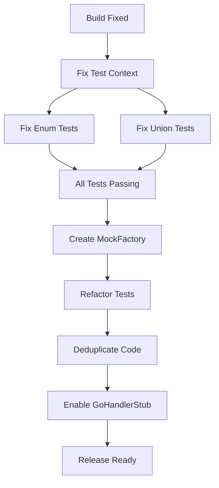

# Critical Test Recovery & Architectural Excellence Plan

**Date:** December 4, 2025
**Status:** BUILD FIXED, TESTS FAILING
**Goal:** 100% Test Pass Rate & clean architecture

## 🎯 Pareto Analysis (80/20)

### 1% Impact (Urgent Fixes - The "Must Haves")
- **Fix `GoEnum/UnionDeclaration` tests**: Failing due to missing Alloy JS scope/context.
- **Fix `GoRouteRegistration` tests**: Failing due to incorrect expectation (JSX vs String).
- **Fix `typespec-emitter-integration`**: Missing module reference.
- **Fix `struct-isolated` test**: output expectation mismatch.

### 4% Impact (Architectural Health)
- **Eliminate `as any` casts in tests**: Create proper `MockFactory` for TypeSpec models.
- **Consolidate `LogContext`**: Ensure unified logging context usage.
- **Resolve Duplication**: `structured-logging.ts` and `union-generator.ts` clones.

### 20% Impact (Feature Completeness)
- **Enable `GoHandlerStub`**: Finish the temporarily disabled component.
- **Enhance Documentation**: Update API reference with new component usage.

---

## 📋 Execution Plan (27 Tasks)

### Phase 1: Critical Test Recovery (Hours 0-2)
1.  [ ] **Analyze Test Context Failures**: Debug `GoEnumDeclaration` scope error.
2.  [ ] **Implement Test Context Wrapper**: Create reusable `renderWithContext` helper for tests.
3.  [ ] **Fix Enum Tests**: Apply context wrapper to enum tests.
4.  [ ] **Fix Union Tests**: Apply context wrapper to union tests.
5.  [ ] **Fix Route Registration Tests**: Update expectations to handle JSX output or render to string.
6.  [ ] **Fix Struct Isolated Tests**: Align expectations with actual Alloy JS output.
7.  [ ] **Fix Emitter Integration Path**: Resolve `../emitter/main.js` path issue.
8.  [ ] **Verify All Tests Pass**: Run full suite.

### Phase 2: Architectural Cleanup (Hours 2-4)
9.  [ ] **Create `MockFactory`**: `src/testing/mock-factory.ts` for strictly typed Model/Enum/Union mocks.
10. [ ] **Refactor `components-alloy-js.test.tsx`**: Use `MockFactory`, remove casts.
11. [ ] **Refactor `doc-decorator-support.test.tsx`**: Use `MockFactory`.
12. [ ] **Refactor `enum-union-integration.test.tsx`**: Use `MockFactory`.
13. [ ] **Refactor `extended-scalars.test.tsx`**: Use `MockFactory`.
14. [ ] **Refactor `pointer-types.test.tsx`**: Use `MockFactory`.
15. [ ] **Refactor `struct-isolated.test.tsx`**: Use `MockFactory`.
16. [ ] **Refactor `route-registration` tests**: Use `MockFactory`.
17. [ ] **Deduplicate `structured-logging.ts`**: Extract common logic.
18. [ ] **Deduplicate `union-generator.ts`**: Extract common logic.

### Phase 3: Feature & Docs (Hours 4-6)
19. [ ] **Analyze `GoHandlerStub`**: Understand why it was disabled.
20. [ ] **Fix `GoHandlerStub` JSX**: Resolve syntax/logic issues.
21. [ ] **Enable `GoHandlerStub`**: Uncomment in `GoPackageDirectory`.
22. [ ] **Add `GoHandlerStub` Tests**: Ensure coverage.
23. [ ] **Update README**: Reflect component architecture.
24. [ ] **Update API Docs**: Document new components.
25. [ ] **Final Lint & Format**: Ensure code style.
26. [ ] **Final Build & Test**: 100% green.
27. [ ] **Release Prep**: Update version/changelog.

## 🧜‍♀️ Dependency Graph

