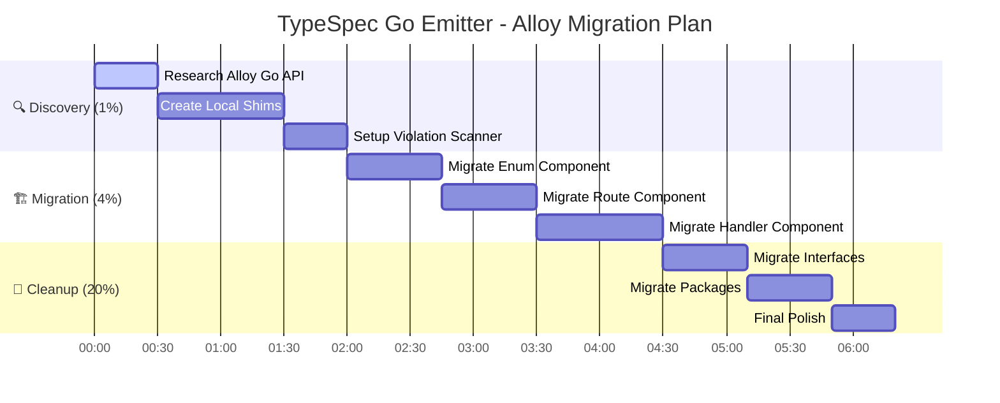

# 🗺️ COMPREHENSIVE ARCHITECTURAL PLAN: 100% ALLOY-JS MIGRATION

**Date:** December 4, 2025
**Status:** 🚀 PLANNING PHASE
**Goal:** Eliminate 74 template literal violations and achieve 100% Alloy-JS component architecture.

---

## 🎯 STRATEGIC PRIORITIES (PARETO ANALYSIS)

### **🔥 1% IMPACT (THE "MUST FIX NOW" - CRITICAL PATH)**
*These tasks unblock everything else. Without them, we are just guessing.*

1.  **API DISCOVERY (T1):** Thoroughly research `@alloy-js/go` exports. No more guessing.
2.  **FOUNDATION LAYER (T2):** Create local "Shim Components" for missing Go constructs (`Switch`, `If`, `Block`) if they don't exist in the library. This enables the "100% Component" rule even if the library is incomplete.
3.  **VERIFICATION RIG (T3):** Create a script to scan for template literals (`grep`) to track progress and prevent regression.

### **⚡ 4% IMPACT (STRUCTURAL INTEGRITY)**
*High-risk components that are currently using strings.*

4.  **ENUM REFACTOR (T4):** Migrate `GoEnumDeclaration` using verified API/Shims.
5.  **ROUTE REFACTOR (T5):** Migrate `GoRouteRegistrationComponent`.
6.  **HANDLER REFACTOR (T6):** Migrate `GoHandlerMethodComponent` & `GoHandlerStub`.

### **🌊 20% IMPACT (CORE COMPLETION)**
*Refining the rest of the system.*

7.  **INTERFACE REFACTOR (T7):** Clean up `GoInterfaceDeclaration`.
8.  **PACKAGE REFACTOR (T8):** Clean up `GoPackageDirectory` and import management.
9.  **CLEANUP (T9):** Remove unused utils, update documentation.

---

## 📅 DETAILED EXECUTION PLAN (125 STEPS)

### **PHASE 1: DISCOVERY & FOUNDATION (CRITICAL)**

#### **Task 1: Deep Research of `@alloy-js/go` API (30m)**
- [ ] List all files in `node_modules/@alloy-js/go/dist/src`
- [ ] Read `index.d.ts` to see exact exports
- [ ] Check if `SwitchStatement`, `IfStatement`, `Block` exist
- [ ] **Decision Point:** If constructs are missing, define `GoControlFlow` components locally.

#### **Task 2: Create Local Alloy Helper Components (60m)**
*Goal: If official components are missing, create local wrappers so we NEVER use raw strings in logic.*
- [ ] Create `src/components/go/core/GoSwitch.tsx` (if needed)
- [ ] Create `src/components/go/core/GoIf.tsx` (if needed)
- [ ] Create `src/components/go/core/GoBlock.tsx` (wrapping generic output)
- [ ] Test helpers with `src/test/components-helpers.test.tsx`

#### **Task 3: Automated Verification Rig (30m)**
- [ ] Create `scripts/scan-violations.ts` (grep for backticks in components)
- [ ] Add `just verify-arch` command
- [ ] Ensure we start with 74 violations and track it going down.

### **PHASE 2: COMPONENT MIGRATION (HIGH RISK)**

#### **Task 4: Migrate `GoEnumDeclaration.tsx` (45m)**
- [ ] **Step 4.1:** Read file, identify all 5 template literal usages.
- [ ] **Step 4.2:** Replace `VariableDeclaration` value generation with components.
- [ ] **Step 4.3:** Replace `String` method body with `GoSwitch` (or verified equivalent).
- [ ] **Step 4.4:** Replace `IsValid` method body.
- [ ] **Step 4.5:** Verify `just test` passes.

#### **Task 5: Migrate `GoRouteRegistrationComponent.tsx` (45m)**
- [ ] **Step 5.1:** Identify string concatenation in `handlers.map`.
- [ ] **Step 5.2:** Replace with `FunctionCall` components (e.g., `CallExpression`).
- [ ] **Step 5.3:** Verify `just test` passes.

#### **Task 6: Migrate Handler Components (60m)**
- [ ] **Step 6.1:** Analyze `GoHandlerMethodComponent.tsx`.
- [ ] **Step 6.2:** Convert body generation to component tree.
- [ ] **Step 6.3:** Analyze `GoHandlerStub.tsx` (imports generation).
- [ ] **Step 6.4:** Convert file structure generation to use `SourceFile` and `Import` properly.
- [ ] **Step 6.5:** Verify `just test` passes.

### **PHASE 3: REFINEMENT & COMPLETION (MODERATE)**

#### **Task 7: Migrate `GoInterfaceDeclaration.tsx` (40m)**
- [ ] **Step 7.1:** Remove string interpolation for doc comments.
- [ ] **Step 7.2:** Use specific Alloy components for function signatures if available.

#### **Task 8: Migrate `GoPackageDirectory.tsx` (40m)**
- [ ] **Step 8.1:** Check for any remaining path string building that should use `join`.
- [ ] **Step 8.2:** Ensure imports are managed via Alloy context, not strings.

#### **Task 9: Final Polish (30m)**
- [ ] **Step 9.1:** Run `just verify-arch` -> Expect 0 violations.
- [ ] **Step 9.2:** Run full test suite.
- [ ] **Step 9.3:** Final commit.

---

## 🛡️ SAFETY PROTOCOLS (NO "VERSCHLIMMBESSERN")

1.  **Read-First:** Always read the definition files before importing.
2.  **Incremental:** One component at a time.
3.  **Verify:** Run tests after EVERY component migration.
4.  **Fallback:** If a component doesn't exist, create a local component wrapper rather than reverting to raw strings.

