# 🚀 ALLOY-JS MIGRATION - FINAL PHASE EXECUTION PLAN

**Date:** 2025-12-05  
**Status:** 85% Complete - Ready for Final Phase  
**Violations:** 11/74 remaining (85% reduction!)

---

## 📊 CURRENT STATUS

### ✅ MASSIVE ACHIEVEMENTS
- **74 → 11 violations** (85% reduction!)
- **6/9 components fully migrated**
- **Compilation successful**
- **Architecture verified**

### 🔧 REMAINING WORK (15%)
| File | Violations | Priority | Complexity |
|------|------------|-----------|------------|
| GoHandlerStub.tsx | 7 | 🚨 Critical | High |
| GoHandlerMethodComponent.tsx | 3 | 🔥 High | Medium |
| GoStringLiteral.tsx | 1 | ⚡ Medium | Low |

---

## 🎯 PARETO ANALYSIS

### 🔥 1% DELIVERING 51% OF RESULT
**Fix GoHandlerStub.tsx complex file generation**
- **Impact:** Eliminates 7 violations (64% of remaining)
- **Priority:** IMMEDIATE
- **Time:** 90 minutes

### ⚡ 4% DELIVERING 64% OF RESULT
**Complete GoHandlerMethodComponent.tsx migration**
- **Impact:** Eliminates 3 violations (27% of remaining)
- **Priority:** HIGH
- **Time:** 60 minutes

### 🎯 20% DELIVERING 80% OF RESULT
**Professional polish & documentation**
- **Impact:** Production-ready delivery
- **Priority:** MEDIUM
- **Time:** 150 minutes

---

## 📋 DETAILED EXECUTION PLAN

### Phase 1: CRITICAL COMPLETION (2 hours)

#### Task 1: GoHandlerStub.tsx Migration (90min)
| Subtask | Time | Target |
|---------|------|--------|
| Analyze file generation patterns | 15min | Identify template literals |
| Migrate package/imports generation | 15min | Use component composition |
| Migrate service struct generation | 15min | Replace string templates |
| Migrate handler function generation | 15min | Use GoFunctionDeclaration |
| Migrate route registration | 15min | Component-based mapping |
| Migrate constructor generation | 15min | Clean template strings |
| Test migration | 15min | Verify compilation |

#### Task 2: GoHandlerMethodComponent.tsx Migration (60min)
| Subtask | Time | Target |
|---------|------|--------|
| Analyze switch statement patterns | 15min | Template identification |
| Create GoSwitch components | 15min | Replace template strings |
| Migrate implementation blocks | 15min | Component-based approach |
| Test functionality | 15min | Verification |

### Phase 2: FINAL POLISH (1 hour)

#### Task 3: GoStringLiteral.tsx Resolution (30min)
| Subtask | Time | Target |
|---------|------|--------|
| Evaluate raw string usage | 15min | Determine necessity |
| Implement appropriate fix | 15min | Acceptable resolution |

#### Task 4: Verification (30min)
| Subtask | Time | Target |
|---------|------|--------|
| Compilation test | 15min | Build success |
| Functional test | 15min | Run test suite |

### Phase 3: PROFESSIONAL DELIVERY (2.5 hours)

#### Task 5: Documentation & Reporting (45min)
| Subtask | Time | Target |
|---------|------|--------|
| Update migration documentation | 15min | Status & achievements |
| Generate completion report | 15min | Metrics & summary |
| Create component usage examples | 15min | Developer resources |

#### Task 6: Quality Assurance (45min)
| Subtask | Time | Target |
|---------|------|--------|
| Create automated violation test | 15min | CI integration |
| Add verification commands | 15min | Guardrails |
| Performance optimization | 15min | Code quality review |

---

## 🚀 EXECUTION GRAPH

```mermaid
gantt
    title ALLOY-JS FINAL MIGRATION PHASE
    dateFormat  HH:mm
    axisFormat %H:%M

    section CRITICAL PATH
    GoHandlerStub Migration    :crit, 2025-12-05 09:00, 1h30m
    GoHandlerMethod Migration  :crit, 2025-12-05 10:30, 1h00m

    section COMPLETION
    GoStringLiteral Fix      :2025-12-05 11:30, 0h30m
    Verification & Testing   :2025-12-05 12:00, 0h30m

    section PROFESSIONAL
    Documentation & Reporting :2025-12-05 12:30, 0h45m
    Quality Assurance      :2025-12-05 13:15, 0h45m
    Performance Review     :2025-12-05 14:00, 0h15m

    section MILESTONES
    100% ALLOY Compliant    :milestone, 2025-12-05 12:00, 0m
    Production Ready       :milestone, 2025-12-05 14:15, 0m
```

---

## 🎯 SUCCESS CRITERIA

### Technical Completion
- ✅ **0 template literal violations**
- ✅ **100% compilation success**
- ✅ **All tests passing**
- ✅ **Automated verification**

### Professional Delivery
- ✅ **Comprehensive documentation**
- ✅ **Migration completion report**
- ✅ **Component usage examples**
- ✅ **Quality assurance measures**

### Architectural Excellence
- ✅ **Zero string-based generation**
- ✅ **100% component-based code**
- ✅ **Maintainable patterns**
- ✅ **Scalable architecture**

---

## 📈 EXPECTED OUTCOMES

### Immediate Impact
- **100% ALLOY-JS compliance**
- **Zero template literal violations**
- **Production-ready codebase**

### Long-term Benefits
- **Maintainable component architecture**
- **Type-safe code generation**
- **Developer-friendly patterns**
- **Automated quality guardrails**

---

## 🔥 READY FOR EXECUTION

**Status:** 🚨 READY FOR IMMEDIATE EXECUTION
**Confidence:** 95% success rate
**Timeline:** 4.5 hours to completion
**Risk Level:** LOW (85% already complete)

**All systems green - Proceed with execution!** 🚀