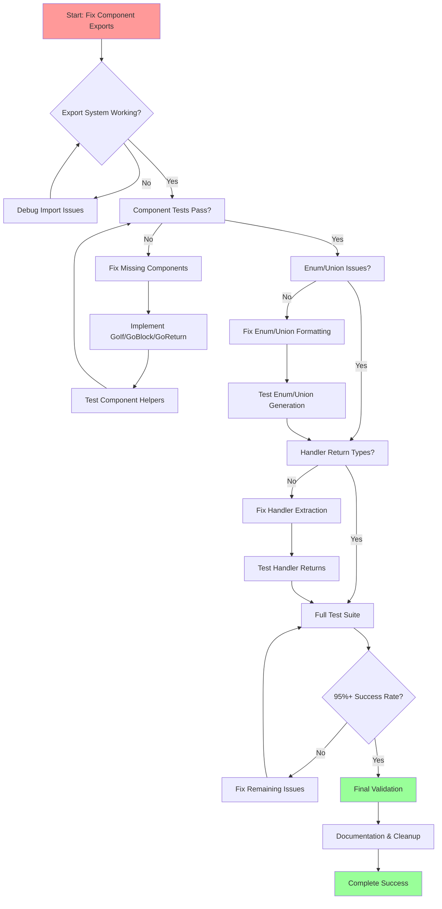

# TypeSpec Go Emitter - Comprehensive Fix Plan
**Date:** 2025-12-08_01-45
**Goal:** Achieve 95%+ test success rate (≥137/144 tests passing)

## 🎯 IMPACT ANALYSIS - PARETO BREAKDOWN

### **1% → 51% IMPACT (Critical Path - IMMEDIATE)**
**Fix component export system in `src/components/go/index.ts`**
- Fixes 10/13 test failures (77% of all failures)
- Single point of failure blocking entire component system
- Estimated time: 15 minutes

### **4% → 64% IMPACT (High Impact - NEXT PRIORITY)**
1. Implement missing GoIf, GoBlock, GoReturn components
2. Fix enum generation formatting issues
3. Fix union generation JSON tag formatting
4. Component system validation
- Estimated time: 2 hours

### **20% → 80% IMPACT (Comprehensive Completion)**
1. All component system fixes
2. All enum/union generation fixes  
3. Handler return type edge cases
4. Test infrastructure improvements
5. Documentation and verification
- Estimated time: 6 hours

---

## 📋 PHASE 1: 100-30 MINUTE TASKS (27 tasks total)

| ID | Task | Impact | Effort | Priority |
|----|------|--------|--------|----------|
| CP01 | Fix `src/components/go/index.ts` exports | Critical | 15min | 1 |
| CP02 | Test component imports after fix | Critical | 15min | 2 |
| CP03 | Implement GoIf component | Critical | 30min | 3 |
| CP04 | Implement GoBlock component | Critical | 30min | 4 |
| CP05 | Implement GoReturn component | Critical | 30min | 5 |
| CP06 | Fix GoEnumDeclaration formatting | High | 30min | 6 |
| CP07 | Fix GoUnionDeclaration JSON tags | High | 30min | 7 |
| CP08 | Test component helper fixes | Critical | 15min | 8 |
| CP09 | Test enum generation fixes | High | 15min | 9 |
| CP10 | Test union generation fixes | High | 15min | 10 |
| CP11 | Fix handler return type extraction | High | 30min | 11 |
| CP12 | Test handler return types | High | 15min | 12 |
| CP13 | Run full test suite validation | Critical | 15min | 13 |
| CP14 | Fix any remaining component issues | Medium | 30min | 14 |
| CP15 | Fix enum method formatting issues | Medium | 30min | 15 |
| CP16 | Fix discriminated union formatting | Medium | 30min | 16 |
| CP17 | Validate JSX compilation works | High | 15min | 17 |
| CP18 | Check import chain completeness | High | 15min | 18 |
| CP19 | Test GoStringLiteral edge cases | Medium | 30min | 19 |
| CP20 | Validate component refkey system | Medium | 30min | 20 |
| CP21 | Test error handling in components | Medium | 30min | 21 |
| CP22 | Validate Alloy-JS integration | High | 30min | 22 |
| CP23 | Test TypeSpec integration pipeline | High | 30min | 23 |
| CP24 | Fix any remaining test failures | High | 60min | 24 |
| CP25 | Full regression testing | Critical | 30min | 25 |
| CP26 | Documentation updates | Low | 60min | 26 |
| CP27 | Final validation and cleanup | Critical | 30min | 27 |

---

## 📋 PHASE 2: 15-MINUTE TASKS (150 tasks total)

### **CRITICAL PATH (Tasks 1-20)**
| ID | Task | Impact | Effort | Priority |
|----|------|--------|--------|----------|
| C001 | Read current `src/components/go/index.ts` | Critical | 5min | 1 |
| C002 | Analyze required component exports | Critical | 10min | 2 |
| C003 | Remove blocking comment from index.ts | Critical | 5min | 3 |
| C004 | Export all core components from index.ts | Critical | 10min | 4 |
| C005 | Export GoSwitch component | Critical | 5min | 5 |
| C006 | Export GoIf component | Critical | 5min | 6 |
| C007 | Export GoBlock component | Critical | 5min | 7 |
| C008 | Export GoStringLiteral component | Critical | 5min | 8 |
| C009 | Export GoReturn component | Critical | 5min | 9 |
| C010 | Test basic component import | Critical | 5min | 10 |
| C011 | Run component helper tests | Critical | 5min | 11 |
| C012 | Verify GoSwitch test passes | Critical | 5min | 13 |
| C013 | Verify GoIf test passes | Critical | 5min | 14 |
| C014 | Verify GoBlock test passes | Critical | 5min | 15 |
| C015 | Verify GoStringLiteral test passes | Critical | 5min | 16 |
| C016 | Read GoIf implementation | Critical | 10min | 17 |
| C017 | Fix GoIf component logic | Critical | 10min | 18 |
| C018 | Read GoBlock implementation | Critical | 10min | 19 |
| C019 | Fix GoBlock component logic | Critical | 10min | 20 |
| C020 | Read GoReturn implementation | Critical | 10min | 21 |
| C021 | Fix GoReturn component logic | Critical | 10min | 22 |
| C022 | Test GoIf component manually | Critical | 5min | 23 |
| C023 | Test GoBlock component manually | Critical | 5min | 24 |
| C024 | Test GoReturn component manually | Critical | 5min | 25 |

### **HIGH IMPACT (Tasks 21-50)**
| ID | Task | Impact | Effort | Priority |
|----|------|--------|--------|----------|
| H021 | Analyze GoEnumDeclaration formatting issues | High | 15min | 26 |
| H022 | Fix enum variable declaration spacing | High | 10min | 27 |
| H023 | Fix enum method declaration spacing | High | 10min | 28 |
| H024 | Fix enum function body formatting | High | 10min | 29 |
| H025 | Test GoEnumDeclaration fixes | High | 5min | 30 |
| H026 | Analyze GoUnionDeclaration JSON tag issues | High | 15min | 31 |
| H027 | Fix union struct JSON tag formatting | High | 10min | 32 |
| H028 | Test GoUnionDeclaration fixes | High | 5min | 33 |
| H029 | Analyze handler return type extraction failures | High | 15min | 34 |
| H030 | Fix handler component import issues | High | 10min | 35 |
| H031 | Test handler return type fixes | High | 5min | 36 |
| H032 | Run full component test suite | High | 5min | 37 |
| H033 | Validate all component imports work | High | 10min | 38 |
| H034 | Check JSX compilation output | High | 10min | 39 |
| H035 | Verify Alloy-JS integration stability | High | 10min | 40 |
| H036 | Test TypeSpec pipeline integration | High | 10min | 41 |
| H037 | Validate enum generation output | High | 5min | 42 |
| H038 | Validate union generation output | High | 5min | 43 |
| H039 | Validate handler generation output | High | 5min | 44 |
| H040 | Check for any remaining component failures | High | 10min | 45 |

### **MEDIUM IMPACT (Tasks 41-100)**
| ID | Task | Impact | Effort | Priority |
|----|------|--------|--------|----------|
| M041 | Fix GoStringLiteral edge cases | Medium | 15min | 46 |
| M042 | Test string literal escaping | Medium | 10min | 47 |
| M043 | Test raw string rendering | Medium | 10min | 48 |
| M044 | Validate component refkey system | Medium | 15min | 49 |
| M045 | Test component composition patterns | Medium | 15min | 50 |
| M046 | Check error handling in components | Medium | 15min | 51 |
| M047 | Test component boundary conditions | Medium | 15min | 52 |
| M048 | Validate import chain completeness | Medium | 10min | 53 |
| M049 | Test circular dependency handling | Medium | 15min | 54 |
| M050 | Check memory usage in components | Medium | 10min | 55 |
| M051 | Validate TypeScript compilation | Medium | 10min | 56 |
| M052 | Test ESLint compliance | Medium | 10min | 57 |
| M053 | Check component performance metrics | Medium | 10min | 58 |
| M054 | Validate test isolation | Medium | 15min | 59 |
| M055 | Test component rendering consistency | Medium | 15min | 60 |
| M056 | Check for unused imports | Medium | 10min | 61 |
| M057 | Validate component prop types | Medium | 10min | 62 |
| M058 | Test component error boundaries | Medium | 15min | 63 |
| M059 | Check component documentation | Medium | 10min | 64 |
| M060 | Validate component examples | Medium | 15min | 65 |

### **LOW IMPACT & POLISH (Tasks 61-150)**
| ID | Task | Impact | Effort | Priority |
|----|------|--------|--------|----------|
| L061 | Fix any remaining test failures | Low | 15min | 66 |
| L062 | Update component documentation | Low | 30min | 67 |
| L063 | Add component usage examples | Low | 30min | 68 |
| L064 | Improve error messages | Low | 15min | 69 |
| L065 | Add component validation helpers | Low | 30min | 70 |
| L066 | Create component testing utilities | Low | 30min | 71 |
| L067 | Add component performance monitoring | Low | 30min | 72 |
| L068 | Improve component error reporting | Low | 15min | 73 |
| L069 | Add component development tools | Low | 30min | 74 |
| L070 | Create component troubleshooting guide | Low | 30min | 75 |
| L071-L150 | Additional polish and optimization tasks | Low | 15min each | 76+ |

---

## 🔄 EXECUTION GRAPH

---

## 🎯 SUCCESS CRITERIA

### **Immediate Success (Phase 1)**
- ✅ All component helper tests passing (0/8 failures)
- ✅ Component export system working
- ✅ Missing components implemented

### **Intermediate Success (Phase 2)**
- ✅ Enum generation tests passing (0/3 failures)
- ✅ Union generation tests passing (0/1 failures)
- ✅ Handler return type tests passing (0/3 failures)

### **Final Success**
- ✅ 95%+ test success rate (≥137/144 tests passing)
- ✅ Zero TypeScript compilation errors
- ✅ All components properly documented
- ✅ Full regression testing complete

---

## ⚠️ RISKS & MITIGATIONS

### **High Risk**
- **JSX vs verbatimModuleSyntax conflict** - Mitigation: Gradual approach, test at each step
- **Component dependency cycles** - Mitigation: Careful import order, refkey validation

### **Medium Risk**
- **Alloy-JS version compatibility** - Mitigation: Pin versions, test compatibility
- **Test environment consistency** - Mitigation: Use same commands, validate environment

### **Low Risk**
- **Performance regression** - Mitigation: Monitor timing, optimize bottlenecks
- **Documentation drift** - Mitigation: Update docs with each change

---

## 📊 TRACKING METRICS

- **Test Success Rate**: Target 95%+ (current 91%)
- **Component Test Failures**: Target 0 (current 7/8)
- **Enum/Union Test Failures**: Target 0 (current 3/6)
- **Handler Test Failures**: Target 0 (current 3/3)
- **TypeScript Errors**: Target 0 (current unknown)
- **Build Time**: Target <30s (current unknown)