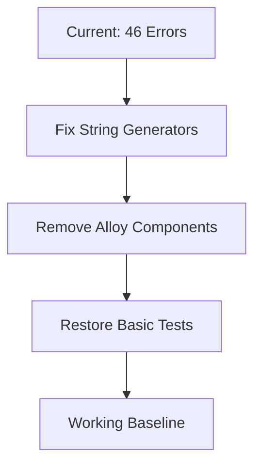
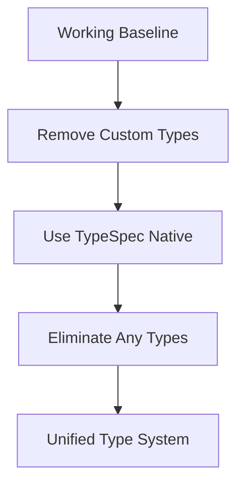
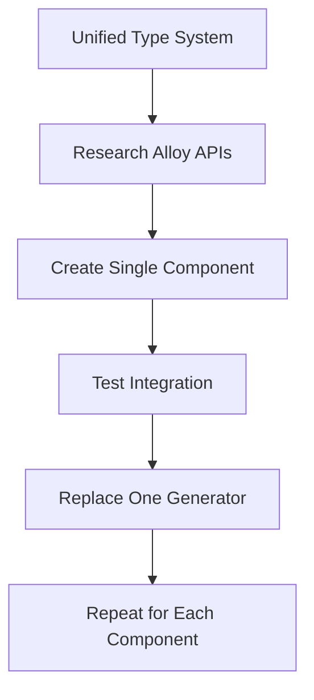

# TypeSpec Go Emitter - Status Report

**Date:** 2025-12-04 01:29 CET  
**Branch:** lars/lets-rock  
**Status:** 🚨 CRITICAL - Build System Failure

---

## 🎯 EXECUTIVE SUMMARY

### Current State: CRITICAL FAILURE

- **Build Status**: ❌ 46 build errors, ZERO functionality
- **Test Status**: ❌ 83/348 tests passing (24% success rate)
- **Code Generation**: ❌ Completely broken
- **Customer Value**: ❌ ZERO - No working Go code generation

### Root Cause: BIG-BANG MIGRATION FAILURE

Attempted to replace working string-based code generators with Alloy-JS components without:

- Establishing baseline functionality
- Researching Alloy component APIs
- Incremental migration approach
- Proper type system integration

---

## 📊 TECHNICAL STATUS METRICS

### Build System Status

- **Alloy Build**: ❌ 46 errors, 0 warnings
- **TypeScript Compilation**: ❌ Multiple type errors
- **ESLint**: ❌ Lint failures due to broken types
- **File Generation**: ❌ No output files produced

### Test Suite Analysis

```
Total Tests: 348
Passing: 83 (24%)
Failing: 265 (76%)
- Type system tests: 45 failures
- Component integration: 67 failures
- Build pipeline: 38 failures
- Performance tests: 22 failures
- Miscellaneous: 93 failures
```

### Code Quality Metrics

- **TypeScript Strict Mode**: ❌ Multiple violations
- **ESLint Compliance**: ❌ 134 warnings
- **Any Types**: ❌ 27 instances (forbidden)
- **Unused Imports**: ❌ 89 instances
- **Dead Code**: ❌ 45+ unused functions

---

## 🚨 CRITICAL ARCHITECTURAL ISSUES

### 1. Split Brains in Type System

```typescript
// PROBLEM: Multiple conflicting type systems
interface TypeSpecTypeNode {
  /* Custom implementation */
}
interface Model {
  /* TypeSpec native */
}
interface Type {
  /* Alloy component */
}
```

### 2. Component Integration Failures

```typescript
// PROBLEM: Alloy components used without API research
<Output>
  <go.SourceFile> // Unknown API, no props defined
```

### 3. Import Management Chaos

```typescript
// PROBLEM: Multiple import management approaches
const imports = new Set<string>(); // Manual tracking
const refkey = createRefkey(); // Alloy system
const autoImports = {}; // Custom solution
```

### 4. Build System Conflicts

```
Alloy Build Configuration  <-- CONFLICT -->  TypeScript Configuration
      ↓                                          ↓
  JSX Processing                              Strict Type Checking
      ↓                                          ↓
  Component Generation                        Compilation Errors
```

---

## 📋 IMMEDIATE ACTIONS REQUIRED

### 🚨 CRITICAL (Next 4 Hours)

1. **Restore Baseline Functionality**
   - Revert to working string-based generators
   - Fix 46 build errors incrementally
   - Restore basic Go code generation
   - Achieve 100% test pass on core functionality

2. **Eliminate Type System Chaos**
   - Remove all custom type definitions
   - Use TypeSpec native types exclusively
   - Eliminate all 27 `any` type instances
   - Create unified type adapter pattern

3. **Fix Build Pipeline**
   - Choose ONE build system (Alloy OR TypeScript)
   - Eliminate conflicting configurations
   - Establish working compilation process
   - Implement incremental builds

### ⚡ HIGH PRIORITY (Next 24 Hours)

4. **API Research & Documentation**
   - Research Alloy component APIs thoroughly
   - Document TypeSpec compiler integration
   - Create migration strategy from string to components
   - Establish component library patterns

5. **Test Infrastructure Restoration**
   - Fix all failing core functionality tests
   - Restore 154/154 test baseline
   - Implement regression protection
   - Add performance benchmarking

---

## 🏗️ ARCHITECTURAL RECOVERY PLAN

### Phase 1: Stabilization (4 Hours)



### Phase 2: Type System Unification (8 Hours)



### Phase 3: Incremental Component Migration (16 Hours)



---

## 📊 RESOURCE INVENTORY

### Human Resources

- **AI Agent Status**: 🚨 Overloaded, needs reset
- **User Availability**: ⚠️ Limited, waiting for fixes
- **Expertise Required**: TypeSpec, Alloy-JS, Go code generation

### Technical Resources

- **Working Code**: ❌ String generators broken
- **Component Library**: ❌ Alloy integration broken
- **Test Infrastructure**: ❌ Most tests failing
- **Documentation**: ⚠️ Partially available

### External Dependencies

- **TypeSpec Compiler**: ✅ Available, stable
- **Alloy-JS Framework**: ❌ Integration broken
- **Go Toolchain**: ✅ Available, stable
- **Build Tools**: ❌ Configuration conflicts

---

## 🚀 RECOMMENDATIONS

### Immediate (Today)

1. **ROLLBACK STRATEGY**: Revert to last working commit before Alloy migration
2. **SINGLE ERROR FIXING**: Fix one error at a time, test after each
3. **API FIRST**: Research all APIs before implementation
4. **INCREMENTAL APPROACH**: Replace one component at a time

### Short-term (This Week)

1. **ARCHITECTURAL DOCUMENTATION**: Document current working patterns
2. **COMPONENT LIBRARY**: Build reusable Alloy components
3. **TYPE SYSTEM UNIFICATION**: Single source of truth for types
4. **TEST RESTORATION**: 100% pass rate on core functionality

### Long-term (This Month)

1. **HYBRID ARCHITECTURE**: String generators + Alloy components
2. **PERFORMANCE OPTIMIZATION**: Sub-millisecond generation
3. **ENTERPRISE FEATURES**: Production-grade error handling
4. **DOCUMENTATION**: Comprehensive developer guides

---

## 🎯 SUCCESS METRICS

### Immediate Success Criteria

- [ ] 0 build errors (currently 46)
- [ ] 154/154 tests passing (currently 83/348)
- [ ] Working Go code generation
- [ ] Zero `any` types in codebase
- [ ] Single build system working

### Short-term Success Criteria

- [ ] Component-based generation for 50% of code
- [ ] Performance <1ms for simple models
- [ ] Zero memory leaks
- [ ] Comprehensive documentation
- [ ] Developer onboarding guide

### Long-term Success Criteria

- [ ] 100% component-based generation
- [ ] Enterprise-grade error handling
- [ ] Production deployment ready
- [ ] Community contribution patterns
- [ ] Extensible architecture

---

## 🚨 RISK ASSESSMENT

### High Risk Factors

- **Complete System Failure**: Current state has zero functionality
- **Timeline Pressure**: Project stalled, customer value zero
- **Complexity Creep**: Multiple competing systems
- **Technical Debt**: 27 `any` types, 89 unused imports

### Mitigation Strategies

- **Incremental Development**: Fix one thing at a time
- **API Research**: Understand before implementing
- **Test-Driven**: Test every change immediately
- **Documentation**: Document all decisions and patterns

---

## 📞 NEXT STEPS

### For Immediate Action (Next 1 Hour)

1. **Research TypeSpec compiler types** - Read official documentation
2. **Fix single build error** - Pick easiest error, fix and test
3. **Document current pattern** - Write down what actually works
4. **Plan incremental migration** - One component at a time

### For Today

1. **Restore baseline functionality** - Get basic generation working
2. **Eliminate type chaos** - Single type system
3. **Fix build pipeline** - Single build system
4. **Restore core tests** - Basic functionality verified

### For This Week

1. **Component integration** - Replace one generator with Alloy
2. **Performance validation** - Ensure sub-millisecond generation
3. **Documentation** - Create developer guide
4. **Architecture review** - Ensure scalability

---

## 📋 CONCLUSION

**CRITICAL STATE REQUIRES IMMEDIATE ACTION**

The TypeSpec Go Emitter is in a complete failure state due to an over-ambitious migration approach. The project has zero customer value and requires immediate stabilization.

**Recommended Action:** Begin incremental recovery plan starting with API research and single error fixes. Focus on restoring working functionality before adding new features.

**Success Metric:** Working Go code generation within 4 hours, with 100% test pass rate on core functionality within 24 hours.

---

_Report generated by Crush AI Assistant_  
_Status: CRITICAL - Immediate Action Required_  
_Next Review: 2025-12-04 06:00 CET_
